# just基础知识

## 应用软件

server：服务器

- c / s 架构：client 客户端
- b / s 架构：browser 浏览器

# **HTML**

- 
  ```HTML
  <!DOCTYPE html>
  <html>
      <head>
          <!--引入资源文件-->
          <title>西南石油大学</title>
      </head>
  
      <body>
          <!--页面主题-->
          <!--一共6级标题-->
          <h1>there is 陈涛主页</h1>
          <h2>2314755084@qq.com</h2>
  
          <!--段落-->
          <p>竹秋拾</p>
  
          <!--超链接-->
          <a target="_blank" href="https://20050606.qzone.qq.com/">qq空间</a>
  
          <p></p>
          <!--图片-->
          <!--图片路径：绝对路径就是我自己电脑上的图片地址；相对路径就是我项目文档里的图片地址-->
          <!--与项目同级图片加上文件名和/;  项目上一级图片加上../-->
            <!--title是光标移动到图片上时的说明-->
            <!--alt用于图片加载异常时显示-->
          
  
          <!--无序列表-->
          <ul type="square">   <!--加上type可以改变前面的图标样式-->
              <li>one🐍</li>
              <li>two🐎</li>
              <li>three🐅</li>
          </ul>
  
          <!--有序列表-->
          <ol type="1">
              <li>第一🐖</li>
              <li>第二🐂</li>
              <li>第三🐏</li>
          </ol>
  
          <!--自定义列表-->
          <dl>
              <dt>
                  陈涛
              </dt>
              <dd>
                  西南石油学生
              </dd>
          </dl>
  
          <!--换行是br-->
          <!--表单-->
          <form action="http://qq.com" method="">  <!--输入数据的提交地址需要后台接口,  有几种提交方式-->
              <!--表单元素-->
  
              <!--文本输入框-->
              <input type="text" placeholder="请输入账号" name="user"> 
  
              <!--输入一个密码类型，输入后显示全部是点-->
              <input type="password" placeholder="请输入密码" name="pwd">  
  
              <br>
              <!--多行文本域即输入多行文字-->
              <textarea name="输入对陈涛的评论" id="" cols="45" rows="10"></textarea>
  
              <!--单选框-->
              <input type="radio" checked name="sex" value="男">男  
              <input type="radio" name="sex" value="女">女  <!--默认选男-->
  
              <br>
              <!--一个按钮， value 表示类型-->
              <input type="button" value="登录">  
              <!--提交按钮，会跳转到action里面的那个网址-->
              <input type="submit" value="跳转到QQ">  
              <!--重置按钮-->
              <input type="reset" value="重置">
  
              <br>
              <!--复选框即可多选-->
              <input type="checkbox" name="course1" value="c">c语言 
              <input type="checkbox" name="course2" value="c++">c++
              <input type="checkbox" name="course3" value="java">jav
          </form>
  
          <!--表格-->
          <table border="0" cellspacing="1" cellpadding="6" width="400" bgcolor="" align="left">  
          <!--border是格子，cellspacing是格子间隙，cellpadding是内容和格子的距离，width是总长度，bgcolor是背景色，align是对齐方式-->
          <!--列合并colspan，行合并rowspan 注意删掉合并单元格的内容-->
              <!--表名-->
              <caption>陈涛</caption>
              <tr>
                  <!--表头-->
                  <th>
                      春
                  </th>
                  <th>
                      夏
                  </th>
                  <th>
                      秋
                  </th>
                  <th>
                      冬
                  </th>
              </tr>
              <tr align="center" bgcolor="yellow">  <!--行-->
                  <td colspan="2">  <!--列或者叫行里面的格子-->
                      出生年月
                      2005年
                  </td>
                  <td>
                      03月
                  </td>
                  <td>
                      19日
                  </td>
              </tr>
              <tr align="center" bgcolor="pink">
                  <td>
                      所处学校
                  </td>
                  <td>
                      成都市
                  </td>
                  <td>
                      新都区
                  </td>
                  <td>
                      西南石油大学
                  </td>
              </tr>
          </table>
  
          <!--元素：标签加上标签里面的内容-->
          <!--块级元素：独占一行-->
          <!--行内元素：字多大就占多大的像素-->
          <!--布局标签-->
          <div>  <!--这个就是块级元素-->
              西南石油大学
          </div>
          <a href="">qq <span>空间</span></a>
          <!--输入框旁边的选项，可以选择代码里给出的内容-->
          <select>
              <option>北京</option>
              <option>上海</option>
          </select>
          <!--锚点，可以跳转到one这个元素-->
          <a href="#one">one</a>
          <div id="one">
              one
          </div>
      </body>
  </html>
  ```


# **CSS**

## 简介

css (cascading style sheets) : 层叠样式表

## 语法

~~~css
div{color:red; font-size:20px;}
~~~

## 使用方法

- 内部样式

  

- 行内样式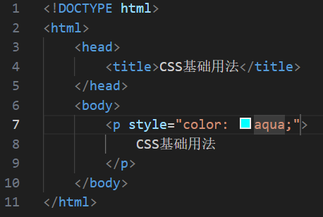

  

- 外联样式：新建一个css文件夹来写入代码

## CSS基本选择器

- 标签选择器：直接选中一种标签，全部一样

- 类(class)选择器

  

- id选择器：

## CSS派生选择器

- 后代选择器（包含选择器）：优先级是各个选择器之和

- 子选择器：优先级是各个选择器之和（只选中第一级元素)

- 群组选择器：
- 兄弟选择器：div+p（选择器1+选择器2），"+"代表紧紧相连的兄弟元素
- 通配符选择器: * (选中页面所有元素)

## 字体样式

- font-size(大小)：正常是16px
- font-style(是否斜体)：italic / oblique / normal
- font-weight(是否加粗)：正常是400（100——900）；lighter / bold / bolder
- font-family(类型)
- font：font-style font-weight font-size（必须有） font-family（必须有）

~~~html
.div
{
	font: 16px "宋体"
}
~~~

## 文本修饰

- color：单词 / # +（十六进制数字如fff）/ rgb(0-255,0-255,0-255)（字体颜色）
- line-height：30px / 1.5em（行高，会垂直居中）
- text-align：center / left / right（文本对齐）
- text-indent：32px / 2em（相对两个字符间隔）
- text-decoration：underline / overline / line-through / none
- text-transform：capitalize（所有单词首字母大写）、uppercase（全部大写）、lowercase（全部小写）

## 超链接样式（伪类选择器）

- a:link（未被访问，只能超链接用）
- a:visited（该超链接被访问过之后的样式，只能超链接用)
- a:hover（鼠标划到文字上时的样式，都可以用）
- a:active（鼠标按一下时的样式，大部分可以用）
- 这几个标签有顺序的，先link然后visited然后hover最后active
- a:focus（输入框内开始输入时的样式，只有表单类元素可以使用）

## 列表样式

- list-style-type
- list-style-image: url(相对路径)
- list-style-position（位置）：inside / outside
- list-style:

## 背景样式

- background-color
- background-image: url(相对路径)
- background-repeat：no-repeat / repeat-x / repeat-y
- backgroundPositionX和Y：背景图片的位置
- background-size
- background:
- cursor：pointer（鼠标变成小手）

## 盒模型

简介:就是把网页中的元素范围抽象成一个盒子

- width

- height

- padding:边线与内容之间的距离,内填充,内边距

  padding-top

  padding-right

  padding-left

  padding-bottom

  padding:上 右 下 左

  padding:上 左右 下

  padding:上下 左右

- border(边框)

  border-top

  border-right

  border-bottom

  border-left

  border-width / -style(solid实线dashed虚线dotted点线double) / -color

  ~~~HTML
  border:10px solid red;
  ~~~

- margin(框之间的距离,外边距)

  margin-top

  margin-right

  margin-bottom

  margin-left

## 块级元素和行内元素

- 块级元素(所有盒模型属性都可以用)

  div / ul / ol / p / dt / dd / dl / li / table / form

- 行内元素

  行内非替换元素: a / span(宽高不能正常使用)

  行内替换元素:  input / img / textarea(内置宽高属性)

## 展示属性

### display: 设置元素展示的形式 (块级或者行内, 隐藏或者显示)

- block: 变成块级
- inline: 变成行内
- inline-block: 变成两者兼具的元素
- none: 设置元素隐藏,除此之外都会隐藏

## 文档流

- 普通流 (normal flow)

  块级元素独占一行；行内元素从左往右依次排列，当放不下时自动换行

- 浮动流 (float)

  元素会尽可能相左或者向右浮动到父元素的边界上，不会超出父元素

  浮动会脱离文档流，其后（非浮动）元素会无视这个元素的存在

  但是浮动不会脱离文本流，后面元素的文本内容会为该元素留出位置

- 定位流 (position)

  完全脱离文档流和文本流

## 浮动（float）

- 属性值

  float：left / right/ none

- 注意事项

  包裹性，浮动以后和子元素同宽（可以理解为作为行内块元素），到最右侧自动换行

  向上性，浮动元素会尽可能向上排布

  浮动元素不会重叠

  浮动后父元素高度塌陷为0

  

## 清除浮动（clear）

- clear：left / right / both
- 

## 伪元素

- :after
- :before
- 用于清除浮动

## 定位（position）

- 要与top / right / bottom / left 等连用

- position: static （没有定位）

- position: relative

  相对定位，相对自己原本的位置定位 

  保留自身位置，不脱离文档流，但是会提高一个层级

  

  

- position: absolute

  绝对定位，相对于其有定位属性（属性值非static）的祖先级元素定位，如果其祖先级元素都没有

  定位属性，则相对于body定位

  会完全脱离文档流，提高一个层级

- position: fixed

  固定定位，相对于浏览器窗口定位

  会完全脱离文档流，提高一个层级

## 层级（上下文）

- z-index: 接整数（无单位），只对定位元素有效

## 溢出处理（overflow）

- overflow: hidden(溢出隐藏) 
- overflow: scroll(出现滚动条)
- overflow: auto(自动)
- overflow: visible（默认值，溢出后不处理）

# HTML5

## 语义化标签

- ## 布局标签

  header：整个页面或者部分区域的头部

  footer：整个页面或者部分区域的底部

  nav：导航

  article：文章、帖子、杂志、新闻、博客、评论

  section：页面中的某段文字，或者文章中的某段文字（里面文字通常会包含标题）

  aside：侧边栏

  main：文档中的主要内容（ie不支持几乎不用）

  hgroup：包裹连续的标题，如文章主标题、副标题的组合

  - article里面可以有多个section
  - section强调的是分段或者分块，如果想把一块内容分成几段的时候，可以使用section
  - article比section更加强调独立性，一块内容如果比较独立、比较完整，应该使用article

- ## 状态标签


- *<**meter**><**/meter**>*：min-low是红色，low-high是黄色，optimum所在区间应该在high和max之间为绿色


- **progress**

  

- ## 列表标签

- **datalist**/**option**


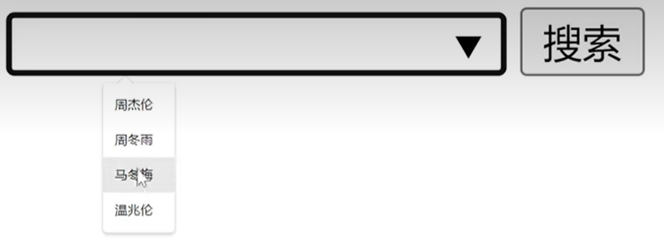

- **details**


- ## 文本标签

- **ruby**

  

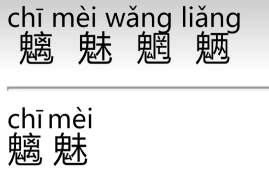

- mark：文本标记，常用于标记搜索结果的关键字

## 表单标签

### 表单控件属性

- required：必选项


- autofocus：自动对焦，自动将光标对在所写框
- autocomplete：on / off ，打开后会记录以前的输入，之后输入相同的第一个字符时会提示
- disabled：禁用表单元素，无需跟值，禁用就disabled = true，不禁用就disabled = false
- checked：在HTML中，`<input>` 元素有一个 `checked` 属性，该属性通常与 `type="checkbox"` 或 `type="radio"` 一起使用。当这个属性被包含（无论是通过显式设置还是通过JavaScript动态添加）时，它表示该复选框（checkbox）或单选按钮（radio button）**已被选中**，其值有true和false。
- **HTML的`selected`属性用于指定`<select>`元素中默认被选中的选项**。当一个`<option>`标签内设置了`selected`属性时，对应的选项将在页面加载时被默认选中。这个属性是一个布尔属性，意味着只要它存在（无论是否带有值，如`selected="selected"`或只是`selected`），就会生效。被预选的选项会显示在下拉列表最前面的位置。

  例如，下面的HTML代码会创建一个下拉列表，其中“Saab”选项在页面加载时默认被选中：

  ```html
  <select>  
    <option>Volvo</option>  
    <option selected="selected">Saab</option>  
    <option>Mercedes</option>  
    <option>Audi</option>  
  </select>
  ```

  另外，你也可以在页面加载后使用JavaScript来设置或更改`selected`属性。所有现代浏览器都支持`selected`属性。
- pattern="正则表达式"：限制字符样式和个数，必须和required一起用，常配合js使用

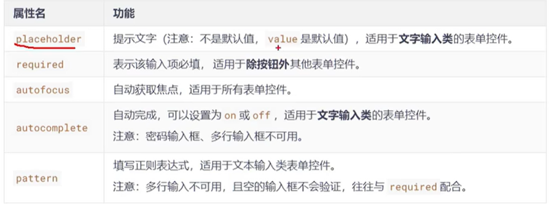

### input的type属性值

- email：（邮箱）邮箱输入框，必须含有@
- url：（网址）网址输入框，必须输入网址
- number：（数值）输入数字的，两个箭头用于加减，也可以自己输入，但是必须是步长step的倍数，可以加max和min来限制大小
- search：（搜索）输入东西搜索
- tel：（电话）作用于移动端手机，输入时限制键盘只能是数字键盘
- range：（范围）可以用max和min改变值，value改变默认值（默认是中间值）
- color：（颜色）可在浏览器选择颜色然后转化为16进制提交
- date：（日期）选择年月日的
- month：（月份）只能精确到月
- week：（周）选择某年的第几周
- time：（时间）选择一天中的某时某分
- datetime-local：（具体的时间）某年某月某日某时某分
- novalidate：不做校验，是写在form里的，会导致form里面的都不在校验，可以任意提交

## 视频标签

### video

- controls：video内部属性，可观看视频、拉进度、调音量等
- muted：默认静音
- autoplay：自动播放（一般来说要和muted一起用，否则不会播放，除非媒体参与度高，浏览器可以有声播放）
- loop：循环播放（要和muted、autoplay一起用）
- poster：视频封面，不能和autoplay一起用
- preload：控制是否预加载

## 音频标签

### audio

## 全局属性

- contenteditable：文本编辑，通过两个值（true和false）来控制用户是否可以对文本编辑
- draggable：拖动元素块，配合js使用才能实现复杂功能
- hidden：隐藏元素，和display-none一样不占位
- spellcheck：拼写检查，检查单词是否错误，要打开浏览器设置
- contextmenu：配合js将右键属性改变
- data-：用于存储用户的私有定制数据，配合js和框架使用

## H5的兼容性处理

**目前级别可用三个方式**


# CSS3

## 简介

## 私有前缀


## 长度单位

- em：字体大小，在浏览器通常是16px，设置了字体大小就会改变
- px：像素单位，是一个数字序列表示图像的最小单位
- %：相对于父级元素宽高的比例单位
- rem：相对长度单位，相对于根元素（即HTML）元素的字体大小。如果根元素字体大小是16px，那么1rem就是16px
- vw：可视化窗口宽的百分比（view width）
- vh：可视化窗口高的百分比（view height）
- vmax：可视化窗口宽与高最大的一个的百分比
- vmin：可视化窗口宽和高最小的一个的百分比

## 颜色设置方式

- rgb：red green bule，利用三原色来控制颜色，类似于三维坐标，最大值255也可以写百分比
- rgba：和rgb一样，多一个值a，是控制透明度的，范围0-1
- hex：#加三组数字，每组数字代表三原色，是16进制，00-ff，ie只支持hex
- hexa：前三组是颜色，第四组是透明度
- hsl：通过色相、饱和度、亮度来控制一个颜色，色相范围是0-360°，饱和度是0%-100%，亮度是0%-100%
- hsla：加一个透明度

## 选择器

- 属性选择器：

  - [属性]，选中具有这个属性的全部元素
  - [属性="值"]，选中这个属性且相同属性值值的元素
  - [属性^="字母"]，选中具有这个属性且属性值以这个字母开头的元素
  - [属性$="字母"]，选中具有这个属性且属性值以这个字母结尾的元素
  - [属性*="字母"]，选中具有这个属性且属性值含这个字母的元素

- 动态伪类：

  - a:link（未被访问，只能超链接用）

  - a:visited（该超链接被访问过之后的样式，只能超链接用)
  - a:hover（鼠标划到文字上时的样式，都可以用）
  - tr:not(:first-child):hover（除了tr的第一个单元格都具备的样式
  - a:active（鼠标按一下时的样式，大部分可以用）
  - 这几个标签有顺序的，先link然后visited然后hover最后active
  - a:focus（输入框内开始输入时的样式，只有表单类元素可以使用）

- 目标伪类

  - div:target：看的是谁就变，选中锚点所指向的元素，配合超链接，给元素加id，然后超链接里面#+id名称

- 语言伪类

  - div:lang(en)：选中div中的语言为en的元素，lang就是语言属性

- UI伪类

  - input:checked：选中的是勾选的复选框或者单选框按钮，**无法改变颜色**
  - input:disabled：选中被禁用的input元素，input要加上disabled属性

- 结构伪类

  - **div>p:first-child{}**，表示选中div下的第一个儿子p元素，是找的**所有儿子**，所以如果第一个元素不是p就会无法选中

  - **div p:first-child{}**，选中的是div的后代p元素，且p元素的父级是谁无所谓，**但p必须是其父级的第一个儿子**
  - **p:first-child{}**，选中的是p元素，且必须是**其父级元素的第一个儿子**
  - **div>p:last-child{}**，最后一个p元素
  - **div>p:nth-child(数字){}**，选中第n个p元素，可以填2n或者even代表偶数，2n+1或者odd代表奇数个，-n+"一个数"代表前n个数，必须是**An+B**的形式
  - **div>p:first-of-type**：选中div的第一个儿子p元素，按照所有同类型兄弟计算的，first可改为last
  - **div>p:nth-of-type**：选中div的第n个儿子p元素，按照所有同类型兄弟计算的

- 否定伪类

  - div>p:not(.fail)，选中div的儿子p元素，排除了类名为fail的元素，括号里面可以任意填属性

- 伪元素

  - div::first-letter：div里的第一个字母、文字……，是元素中的一些特殊位置
  - div::first-line：第一行（可视化的第一行）
  - div::selection：选中被鼠标选中的元素
  - input::placeholder：选中的是input提示的文字
  - ::before{content:" "}：在内容之前，鼠标选不中
  - ::after{content:" "}：内容之后

## 选择器优先级

- 通配符选择器*<元素选择器<类选择器<ID选择器<**行内样式**<属性值后加了**！important**的
- 复杂选择器判断优先级
  - 格式（a，b，c）
  - a：ID选择器的个数；b：类、伪类、属性选择器的个数；c：元素、伪元素选择器的个数
  - 先比a再比b最后比c

## 盒子属性

- box-sizing：
  - content-box：扩张盒子，加盒子大小，规定的w和h就是内容大小
  - border-box：表示盒子一共就是规定的大小，padding、border、margin不会多要空间，即压缩内容空间

- resize：（必须配合overflow）
  - horizontal：水平方向上可以任意改变大小
  - vertical：垂直方向上可以任意改变大小
  - both：两个方向

- box-shadow：（盒子阴影）
  - **两个值**box-shadow：10px 10px，水平和竖直两个方向上的影子
  - **三个值**box-shadow：10px 10px blue，影子颜色是蓝色
  - **三个值**box-shadow：10px 10px  10px，第三个像素值是阴影的模糊值
  - **四个值**box-shadow：10px 10px 10px blue
  - **五个值**box-shadow：10px 10px 10px 20px blue，第四个值就是阴影的外延，即阴影大了多少
  - **六个值**box-shadow：10px 10px 10px 20px blue inset，往里阴影

- opacity：（调整不透明度，值的范围是0—1）

## 背景属性

- background-origin：设置背景图的原点，默认原点是padding的**左上角**
  - padding-box
  - content-box
  - border-box
- background-clip：修剪背景图
  - padding-box：只有padding以内有图
  - content-box
  - border-box
  - **text：背景图在文字上，文字调成透明（transparent）**
- background-size：背景图大小
  - contain：图片等比例缩放，自动填充容器
  - **cover**：尽可能展示完整图片
- background复合属性：背景颜色   url（网址） 是否重复   位置/大小   原点  裁切方式
- 多背景图，这样子就是在四个角的


## 边框属性

- border-collapse：collapse，合并相邻边框，给父级加
  
- border-radius：边框圆角，可以接像素值和百分比；或者左上x  右上x  右下x  左下x  /  顺时针四个y
  
  - border-top-left-radius：左上角，可以接一个值或者两个值，两个值就是椭圆（同理有top-right和bottom-left）
  
- outline：外边框轮廓，默认在border外面，通过调整像素大小可以变大或者进入盒子内部，**不占位，不计入盒子大小**

  - outline-width
  - outline-color
  - outline-style（实虚线）：none / dotted（点）/ dashed（虚线）/ solid（实线）/ double（双线）/  wavy（波浪线）
  - outline-offset（偏移量即调整大小位置，接像素值）
  - outline：width  color  style（offset要单独写）

  

## 文本属性

- text-shadow：文本阴影
  - **两个值**text-shadow：10px 10px，水平和竖直两个方向上的影子
  - **三个值**text-shadow：10px 10px blue，影子颜色是蓝色
  - **三个值**text-shadow：10px 10px  10px，第三个像素值是阴影的模糊值
  - **四个值**text-shadow：10px 10px 10px blue

- white-space：文本换行
  - 加上pre属性值：和pre标签一样的作用，按原文显示，内容太长会超出父元素范围
  - pre-wrap：在pre效果的基础上，超出元素边界会换行
  - pre-line：在pre效果的基础上，超出元素边界自动换行，且只识别文本中的换行，无效空格会忽略
  - **nowrap**：全部内容作一行，强制不换行
- text-overflow：文本溢出
  - clip属性值：配合white-space nowrap / overflow 非visible可以把溢出的截掉
  - ellipsis：配合white-space nowrap / overflow (常用)hidden可以在文末加上三点的省略号

## 文本修饰

- text-decoration：line style color
  - -line：控制是否有下划线
  - -style：控制线的样式
  - -color：控制线的颜色

## 文本描边

- 只能webkit使用，可以写复合属性，常用于写**空心文字**
- -webkit-text-stroke-color：字体边上的颜色
- -webkit-text-stroke-width：宽度

## 新增渐变

### 线性渐变

- background-image：linear-gradient（颜色，颜色……），默认从上到下
- background-image：linear-gradient（**to right**，颜色……），颜色起点是按顺序的，从左往右，可以改为left或者组合的方向
- background-image：linear-gradient（**20deg**，颜色……），顺时针旋转20°
- background-image：linear-gradient（颜色 50px，颜色100px，颜色150px），那么0-50px为纯色，50px为纯色，50-100px为渐变，100px为纯色，100-150px为渐变，150px以后为纯色

### 径向渐变

- background-image：radial-gradient（颜色，颜色……），从内到外，圆的形状随宽高 比列变化
- background-image：radial-gradient（**at  right  top**，颜色，颜色……），调整圆心位置
- background-image：radial-gradient（at  100px  50px，颜色，颜色……），调整圆的大小，前为长半轴，后为短半轴
- background-image：radial-gradient（circle，颜色，颜色……），通过**circle**关键字强制将颜色轮廓转化为正圆，也可以通过直接加两个像素值来调整轮廓
- background-image：radial-gradient（颜色 50px，颜色100px，颜色150px），那么圆心-50px为纯色，50px为纯色，50-100px为渐变，100px为纯色，100-150px为渐变，150px以后为纯色。调整径向渐变的区域

### 重复渐变

- 在没有发生渐变的区域重新发生渐变，即纯色区域重新渐变
- background-image：repeating-radial-gradient
- background-image：repeating-linear-gradient

## web字体

- 外部引入ttf文件在项目文件里面，使用时要用自己取得名字

- https://www.iconfont.cn/webfont去定制字体

## 字体图标

- 阿里矢量图标库，https://www.iconfont.cn

- 网站建立项目，添加字体图标

- 使用方法

  - **下载到本地**

  - 第一种Unicode，将ttf和woff文件放入工作台项目文件

  - 第二种Font class，引入下载的css文件

    

  - 第三种Symbol，彩色的，需要js文件

    

  - **生成在线网址，在线使用**

  - 第一种Unicode

  - 第二种Font class

    

  - 第三种Symbol，引入js

    

## 2D变换

### 位移

- 不脱离文档流，**不会影响其他元素**，效率更高
- **位移对行内元素无效**
- transform：translateX(50px)；transform：translateX(50%)，**移动自己的百分比**，定位是父级百分比
- transform：translateX(50px)  translateY(50px)  /  transform：translate(50px，50px)

### 缩放

- **不可用于行内元素**，可以将字体缩小到12px(浏览器默认最小字体)以下
- transform：scaleX(0.5)，缩小为原来的1/2，内容也会变化，值**可以是负数翻转**，同样可以是X、Y或者一起写

### 旋转

- transform：rotateZ(20deg)，给一个角度(angle)来旋转，2D旋转是绕Z轴转

### 扭曲

- transform：skewX(30deg)，往左扭曲

### 多重变换

- 旋转会破坏坐标系，多重变换时将旋转放在最后，缩放靠后

### 变换原点

- 对位移没有影响(位移只与坐标原点有关)，对旋转和缩放会 有影响
- transform-origin：left top，绕左上角转
- transform-origin：50px 50px，根据坐标系上的点转，也可以是百分比

## 3D变换

### 3D空间与景深

- 要给父级开启3D空间，transform-style：preserve-3D；
- 在父级元素处加上景深，perspective：500px，景深即眼睛离元素的距离，越大越不明显，越小越往脸上撞，默认为没有
- 子元素即要设置3D的元素，transform：rotateX(30deg)，向里旋转30°

### 透视点的位置（观察者的位置）

- 就是观察者的位置，默认的透视点在开启3D空间元素（父元素）的中心
- 使用perspective-origin设置透视点的位置，加在父级元素上，第一个值是水平方向上，正值就是往左走，第二个值是竖直方向上的，正值就是蹲下

### 位移

- 前提是**父级开启3D并设置了景深**
- transform：translateZ(100px)，向屏幕外移动100px，translateZ不可写百分比
- transform：translate3d(X,Y,Z)，三个值都不可少

### 旋转

- transform：rotateX / rotateY，x是从右边看顺时针，y是从下面看顺时针
- transform：rotate3d(1,1,1,30deg)，前三个值表示x、y、z是否旋转，最后一个值表示旋转多少度

### 缩放

- transform：scaleZ(4)，调景深，将景深调为了原景深除4
- transform：scale3d(1,1,1)，三个值不可省略

### 多重变换和变换原点

- transform-origin：left / 0px，都是绕y轴
- transform-origin：100px 100px，绕着y=100px轴旋转，或者x=100px轴旋转，主要是看写得绕哪个轴转

### 背部可见性

- 翻转了之后背部内容可见
- backface-visibility：hidden，隐藏背部内容，翻转后背部内容看不见

## 过渡

### 基本使用

- 属性值要可以是**数值**表示才可以用过渡，transition-property：all  就可以让所有可以设置过渡的属性都过渡
- 常支持过渡的属性有：颜色，长度值，百分比，z-index，opacity(透明度)，2D、3D变换属性，阴影
- transition-property：过渡属性

- transition-duration：接过渡时间 

### 高级使用

- transition-delay：2s，过渡延迟
- 因为默认过渡先慢再快最后慢，可以调整
- transition-timing-function：ease（平滑过渡即默认）/  linear（匀速）/  ease-in（先慢再快）/  ease-out（先快再慢）/  ease-in-out（先慢再快然后慢）/  step-start（不过渡，直接到终点）/  step-end（等过渡时间完了直接到终点）/  steps(20)（分为20份一份一份过渡）
- transition-timing-function：cubic-bezier（，，，）贝塞尔曲线，还可以回弹；https://cubic-bezier.com

### 复合属性

- transition：duration  property  delay  timing-function，第一个时间是duration，第二个时间是delay

## 动画

### 基本使用

- animation-name：

- 动画延迟时间：animation-delay

- ~~~css
  <!--定义关键帧第二种方式-->
  @keyframes 名字
  {
      0%
      {
  	}
      10%
      {
  	}
      ……
      100%
      {
  	}
  }
  ~~~

### 其他属性

- animation--timing-function：ease（平滑过渡即默认）/  linear（匀速）/  ease-in（先慢再快）/  ease-out（先快再慢）/  ease-in-out（先慢再快然后慢）/  step-start（不过渡，直接到终点）/  step-end（等过渡时间完了直接到终点）/  steps(20)（分为20份一份一份过渡）
- 设置动画的方式 animation--timing-function：cubic-bezier（，，，）贝塞尔曲线，还可以回弹；https://cubic-bezier.com
- 动画播放的次数 animation-iteration-count：3；动画播放三次，infinite无限播放
- 动画的方向 animation-direction：normal / reverse(反转) / alternate(往复运动) / alternate-reverse(先从最后帧开始运动)
- 不发生动画时候的状态 animation-fill-mode：forwards(留在最后一帧) / backwards(归位到第一帧)
- 动画播放状态 animation-play-state：paused(暂停) / running，用在:hover可以变成鼠标控制停止动画

### 复合属性

- animation：name  3s  0.5s  linear  2  alternate-reverse  forwards，第一个数值是持续时间duration，第二个值是停留时间delay，第三个值是重复次数iteration-count

### 动画和过渡的区别

- 动画不需要触发条件，过渡必须要触发条件
- 过渡不能有变化样式

## 布局方式

### 多列布局案例

- column-count：3；将内容分为三列
- 纯数字应当加上word-wrap：break-word属性
- 调整列间距 column-gap：20px，默认一个字符，写0px也会有一定间距
- column-rule-width/style/color：边框线的属性，可以写复合属性
- column-span：all，加在需要横跨多个列的标签上比如h1，就可以让标题自占一大行
- 插入图片时要设置width：100%，是一列内容的100%

### 多列布局图片

- 

## 伸缩盒模型(弹性盒子)

### 伸缩容器和伸缩项目

- **伸缩项目块状化**，宽高会起作用
- 开启display：flex或者inline-flex就是伸缩容器，伸缩容器所有子元素就是收缩项目
- display：flex；同级伸缩容器会按块级元素排列，只有子元素是伸缩的
- display：inline-flex；同级伸缩容器会按照行内元素排列，孙元素也会成伸缩项目

### 主轴方向

- flex-direction：row(默认主轴从左往右，侧轴从上往下)
- flex-direction：row-reverse(调整主轴水平从右往左)
- flex-direction：column(调整主轴竖直从上到下，侧轴从左往右)
- flex-direction：column-reverse(调整主轴从下往上，侧轴从左往右)

### 主轴上的换行方式

- 默认nowarp挤在一行，缩小了

- flex-wrap：warp，会尽可能使用空间，不一定挨着

- flex-wrap：wrap-reverse，上下颠倒了从下面开始排布

  

### flex-flow

- flex-flow：direction  wrap

### 主轴上的对齐方式

- justify-content：flex-start，主轴的起始位置
- justify-content：flex-end，主轴的结束位置
- justify-content：center，主轴的居中位置
- justify-content：space-around，伸缩项目与边缘距离为一倍距离，伸缩项目之间两倍距离，均匀分布
- justify-content：space-between，第一个伸缩项目紧贴主轴原点，最后一个伸缩项目紧贴主轴末尾，均匀分布
- justify-content：space-evenly，均匀的分布，伸缩项目之间和项目与边缘都是相同的距离

### 侧轴上的对齐方式

#### 一行

- align-items：flex-start，侧轴的起始位置对齐
- align-items：flex-end，侧轴的结束位置对齐
- align-items：center，侧轴的中间位置对齐
- align-items：baseline，基线对齐即内容底线对齐
- align-items：stretch，在伸缩项目没给高度时，会将伸缩项目元素拉伸到和父容器一样高，是默认值

#### 多行

- align-content：flex-start，按侧轴起点挨着排布，但是同一行如果有不同的heigh将按照最高的来算下一行的起点即当作一个块元素
- align-content：flex-end，按侧轴最后的位置挨着排布，但是同一行如果有不同的heigh将按照最高的来算下一行的起点即当作一个块元素
- align-content：center，居中对齐
- align-content：space-around，伸缩项目与边缘距离为一倍距离，伸缩项目之间两倍距离，均匀分布
- align-content：space-between，第一个伸缩项目紧贴侧轴原点，最后一个伸缩项目紧贴侧轴末尾，均匀分布
- align-content：space-evenly，均匀的分布，伸缩项目之间和项目与边缘间距都是相同的距离
- align-content：stretch，在伸缩项目没给高度时，会将伸缩项目元素拉伸到和父容器一样高，是默认值

### 元素的垂直水平居中(待添加)

- 方案一：都加在父元素上
  - justify-content：center
  - align-items：center
- 方案二（父元素没高度也不行）
  - 父元素加display：flex
  - 子元素加margin：auto
- 方案三
  - 给父元素加上height：calc(100vh - npx)
  - 然后给子元素加上margin：auto

### 项目在主轴的基准长度

- flex-basis：300px；单独给一个伸缩项目设定主轴上的基准长度，即沿主轴方向上的长度失效，变为所设的长度值

### 伸缩盒模型——伸

- flex-grow：1；写在伸缩项目中，几个项目将瓜分一行内剩余的空间，数字表示比例，默认值是0

### 伸缩盒模型——缩

- 不换行即不加flex-wrap：wrap属性
- flex-shrink：1；默认值为1，

- 修改了flex-shrink数值后

- 会保证内容的呈现，所以最小的大小也会让内容完全呈现出来

### flex复合属性

- 

### 项目排序与单独对齐

#### 项目排序

- order：加数字，小的在左边，默认值为0

#### 单独对齐

- align-self：调整侧轴排列，默认值auto

## 响应式布局

### 媒体查询-媒体类型

- 写在c3里面，大括号内是c3的内容，自动识别打印机，然后更改样式，写在正常内容后面

- 将print改为screen表示识别到屏幕就应用，还有一个属性为all，所有都应用

### 媒体查询-媒体特性

- 

- 识别屏幕宽度（要考虑缩放）

- 总结

### 媒体查询-运算符

- and：并且
- ，或者 or：或
- not：否定
- only：肯定运算符，用于处理ie浏览器无法识别媒体特性
- 总结

### 媒体查询-常用阈值

- 这里有两种应用媒体查询，第一种是在同级文件建立css文件，写上media关键字，第二种就是写正常的css语句，但是在html文件引用时在link标签加上media和应用条件

## BFC

block formatting context：块级格式化上下文，就是页面中的一块渲染区域，并且有一套渲染的规则。它决定了其子元素将如何定位以及与其他元素的关系、相互作用等。


inline formatting context：行内格式化上下文

GFC FFC

### 创建BFC

- html根元素
- 浮动元素（float属性值除none以外的）
- 定位元素（固定定位和绝对定位）
- display为inline-block，flex，inline-flex、flow-root等其中之一的元素
- 设置overflow除了visible以外的值
- 表格单元格：table、thead、tbody、tfoot、th、td、tr、caption
- 伸缩项目
- 多列容器
- column-span为all的元素(即使该元素没有包裹在多列容器中)

### 普通文档流布局规整

- 浮动元素是不会被父级计算高度
- 非浮动元素会覆盖浮动元素的位置
- 第一个子元素的margin会传递给父级(以大的值为最终值)
- 两个相邻的子元素上下margin会重叠(以大的值为最终值)

### BFC布局规则

- 如果父级触发了BFC,浮动子元素是会被父级计算高度的

  BFC可以识别浮动子元素

- 非浮动元素(触发了BFC), 不会覆盖浮动元素的位置

  BFC可以识别浮动的同级元素

- 如果父级触发了BFC, 第一个子元素的margin不会传递给父级

- 给其中一个元素添加一个父级并触发BFC, 上下margin就不会重叠了

  BFC是一个独立的、封闭的渲染区域，子元素的样式对BFC以外的元素不产生影响

### BFC作用

- 可以解决浮动的高度塌陷问题
- 可以解决盒子之间的外边距重叠或者传递等问题
- 可以制作弹性布局（双飞翼布局）

# JavaScript基础

## JS的简介和组成

- **js简介**：一种编程语言，运行在浏览器上，实现人机交互效果
- **js的作用**：可以实现**网页特效**、**表单验证**（验证页面数据合法性）、**数据交互**（获取后端数据通过渲染呈现）、**服务端编程**（node.js）
- **js的组成**：
  - ECMAScript：js语言基础，规定了如变量、分支语句、循环语句、对象等
  - Web APis
    - DOM：页面文档对象模型，操作文档，比如对页面元素进行移动、大小、添加删除等操作
    - BOM：浏览器对象模型，操作浏览器，比如页面弹窗、检测窗口宽度、存储数据到浏览器等

- MDN网站，查询权威内容

## JS的书写位置

- 内部JavaScript
  - 直接写在html文档，用script标签包住
  - 规范：script标签要写在</body>上面
  - 拓展：alert('你好，js')，页面弹出警告对话框
  - 注意事项：将<script>放在body底部是因为浏览器是按照**代码顺序**加载html文件，如果先写js可能会因为html还未加载而失效

- 外部JavaScript
  - 代码写在以.js结尾的文件里，通过script标签引入html文档
- 内联JavaScript如：

## JS怎么写

- 单行注释：//
- 块注释：/* */
- 结束符：使用英文的 ' ; '代表语句结束，但是可写可不写

## JS的输入输出语法

### 输出语法

- document.write('我是div标签')，普通的页面输出，向body内输出内容
- document.write('<h1>我是标签</h1>')，这种输出带有标签特性
- alert('输出内容')，页面弹出警告对话框
- console.log('控制台打印')，控制台输出，调试使用，不在页面呈现
- console.dir()，打印对象
- 注意，输出**字符串加单引号**，如果是变量就只需要直接括号里面加变量名

### 输入语法

- prompt('请输入您的年龄')
- 作用：显示一个对话框，对话框包含文字信息

## 字面量

- 数字字面量
- 字符串字面量：'陈涛帅哥'
- 数组字面量：[ ]
- 对象字面量：{ }

## 变量

- 变量就是一个装数据的盒子，用来储存数据
- 声明变量：let + 变量名
- 变量赋值：变量名 = 值，与c语言相同
- 输入——保存数据——输出
- 变量命名只能由**数字、字母、下划线、和$**组成，起名要有意义且遵守小驼峰命名法如userName
- var和let区别，
  - var可以先使用再声明，无法读到数据
  - var可以重复声明同一个名称变量，不合理
  - 没有块级作用域

## 数组

- 声明数组：let + 变量名 = [数据1， 数据2， 数据3]
- 引用数组变量：变量名[序号]，序号从0开始
- 数组长度：变量名.length
- 修改数组
- 数组增加元素
  - 
  - newarry.push()新增的内容会加到数组**末尾**，而且要**返回数组新长度**
  - newarry.unshift()新增内容加到数组**开头**，并**返回数组新长度**
- 数组删除元素
  - arr.pop()删除数组**最后一个值**，并且**返回这个元素值**
  - arr.shift()删除第一个元素，返回元素值
  - arr.splice( , )**随机**删除元素，可以指定删几个，第一个值是起始位置，第二个值是删几个，返回元素值

## 常量

### 基本知识

- 概念：使用const声明的变量称为"常量"
- 使用场景：当某个变量永远不会改变的时候
- 命名以及使用都和变量(let)一致
- 注意：常量无法重新赋值，声明时必须初始化
- 基本数据类型用const声明就不能改变，**复杂数据类型**比如<u>**数组或对象**</u>在声明时可改变，因为他们**存储的是地址**，一样可以进行增删查改

## 数据类型


### 基本数据类型（简单数据类型）

- number：数字型，js是弱数据类型，随便正负或者整数小数
  - 求和：+
  - 求差：-
  - 求积：*
  - 求商：/
  - 取模：%
  - **NaN**：代表计算错误，not a number
  
- string：字符串型

  - 以单引号（ ' ' ），或者双引号（ " " ）,以及反引号（ ‘ ），包裹的数据都叫字符串，单引号和双引号本质上没有区别，推荐使用单引号

  - 外双内单或者外单内双，即**引号配对**

  - 转义符 \ ，\’即代表输出单引号

  - **+号，数字相加字符拼接** 'ct' + '帅哥' 输出是ct帅哥

  - +号，（'我今年' + age）将输出我今年…岁

  - 模板字符串

    - 用反引号``

    - 内容拼接变量时，用${ }包住变量

- boolean：布尔型

  - 只有true和false
  - 将某个内容转换成布尔型Boolean(内容)，空字符串、数字0、undefind、null、false、NaN都是false，其余都为真
  - 在转化为布尔类型中null == undefind是为真的，null === undefind是为假的

- undefined：未定义型

  - 只声明了变量而未赋值则默认为undefined
  - 除了作字符串操作外都为NaN

- null：空对象类型

  - let age = null
  - 赋值为空，不储存值，**注意null类似于对象**即let obj = { }，这是JS的历史存留问题，与二进制储存有关，开头都是000
  - 计算时null为0，而undefined为NaN

### 引用数据类型(复杂数据类型)

- object：对象
- 引用数据类型：在存储时仅仅存储地址，通过new关键字创建的对象如Object、Array、Data

### es6新数据

- Symbol：创建后独一无二且不可变的数据类型
- Bigint：数字类型数据，表示任意精度的整数，Bigint可以储存**超过Number的数据**

## 检测数据类型

- 通过typeof运算符可以返回被检测的数据类型
  - 作为运算符：typeof x（常用的写法）
  - 函数形式：typeof (x)

## 类型转换

- 隐式转换
  - 某些运算符被执行时，系统内部将自动将数据类型进行转换
  - **+**号两边只要有一个是字符串都会把另一个转成字符串，+‘123’可以转换成数字型 
  - 减号 - 和乘 * 除 / 都会将数据类型转成数字类型
  - 任何数据和字符串相加结果都是字符串
  - ' ' + 2 输出为'2'
  - ' ' - 2 输出为-2
  - null + 3 输出为3
  - undefind + 3 输出为NaN
- 显示转换
  - console.log(Number(str) )将字符串str强制转换成数字
  - let num = Number(promot('请输入'))
  - 小技巧利用隐式转换：+promot('请输入')
  - **Number**：转成数字，如果字符串内有非数字会输出NaN
  - **parselnt**：只提取字符串里的**数字开头**的数字，不四舍五入
  - **parseFloat**：提取字符串里的数字开头的数字，**可以保留小数**

## 运算符

### 赋值运算符

- 对变量进行赋值
- =、+=、-=、*=、/=、%=

### 几元运算符

- 一元运算符：++、--、+和 - (用来改变符号)
- 二元运算符：如*、/、%
- 三元运算符：? :

### 比较运算符

- 有**隐式转换**，会把字符型数字字符转换成数字
- NaN不等于任何东西，包括自己即涉及到NaN就都是false
- 字符串比较是比较ASCⅡ码
- 大于>
- 小于<
- <=和>=
- ==：值是否相等
- ===：**值和类型**是否相等，判断了数据类型**(常用)**
- !==：是否不全等

### 逻辑运算符

- &&：逻辑与
- ||：逻辑或
- ！：逻辑非
- **逻辑中断**：false && age++，在读到false时就停止了，**age不会自增**，true && true的值是最后一个真值，false || true的值为最后一个真值

### 运算符优先级

- ()
- ++、--、！
- 先 * / % 后 + -
- 关系运算符>、>=、<、<=
- ==、!=、===、!==
- 先&&后||
- 赋值=
- 逗号，

## 分支语句

- if分支语句
- 三元：条件？满足条件的代码：不满足条件的代码
- switch分支语句效率高于if-else

## 循环语句

### while循环

- while（循环条件）{}

### for循环

- for （变量起始值；终止条件；每次循环所做运算）{}
- for循环嵌套

## 函数

### 使用及传参

- 使用方法：先封装再调用

- 传参一：在定义函数时将（）里加入参数并且函数内使用参数，然后在调用函数时赋值如function  getSum(end)；getSum(50)
- 传参二：（）里面加两个数
- **获取变量时就近原则**

### 数组传参

- 

### 函数返回值

- 函数内标明return 
- 然后let 变量储存return值
- 若没有赋值则返回undefind
- 返回多个值时用数组，return[max, min]

### 匿名函数

- 没有名字的函数
- 函数表达式使用方式
  - 函数表达式：将匿名函数赋值给一个变量如 let sum = function()  {}
  - 调用时sum（）
  - 具名函数可以在任何时候调用不论函数体前后，而匿名函数只能先声明后调用

- 立即执行函数使用方式
  - 目的：避免全局变量之间的污染
  - 语法
  - 最后的小括号本质还是调用函数，可以传入参数，**最后必须加分号‘；’** 

## 对象

- 语法类似于c语言结构体，内部变量是局部变量
- 定义属性名时可以为'goods-name' 或者"goods-name"；查找时对象名['属性名']

### 增删查改遍历

- 查询：对象名.属性如 obj.name 或者 对象名['属性名']
- 更改：对象名.属性 = 新值
- 增加：对象名.新属性名 = 新值
- 删除：delete 对象名.属性
- 遍历：k就是属性名，是**字符串**即 'liu'，如果是数组就是下标字符串即'0'（**很重要！！！**）

### 对象方法

- 对象里的函数叫**方法**调用时以对象属性方式调用，可以传参数

### 数组对象

- 需要使用普通数组遍历即普通for循环

## 内置对象

- js内部提供的对象，包含各种属性和方法给开发者调用
- 内置对象-Math：数学运算，使用时Math.属性名
  - random：生成0 - 1之间的随机数（包括0不包括1）
  - ceil：向上取整
  - floor：向下取整
  - round：四舍五入，-20.5会四舍五入为-20，**注意负数取值**
  - max：找最大值
  - min：找最小数
  - pow：幂运算
  - abs：绝对值
  - sqrt：算术平方根
  - ……

- random的各种操作
  - 取0-10的随机数，若随机取数组的某一个值则乘以数组长度arr.length
  - 

# API

### 作用

- 使用js去操作html和浏览器

### 分类

- DOM（文档对象模型）
- BOM（浏览器对象模型）

### 什么是DOM

- DOM（Documet Object Model——文档对象模型）是用以呈现HTML或XML文档交互的API

### DOM的作用

- 操作网页内容，通过js动态更新HTML文档中的标签元素

### DOM树

- 将HTML文档以树状结构直观表现出来
- 作用：文档树直观的体现了标签与标签之间的关系

### DOM对象

- 是浏览器根据html标签生成的js对象
  - 所有的标签属性都可以在这个对象上找到
  - 修改这个对象的属性会自动映射到标签身上

## DOM获取元素

### 通过css选择器来获取

- 选择匹配的**第一个元素（只选择一个）**
  - 选择第一个
    - 语法：**document.querySelector('css选择器')**
  - 选择类名
    - 语法：document.querySelector('css选择器类名如**.box**')
  - 具体选择某个标签(这里叫对象)
    - 语法：document.querySelector('ul li:first-child')
  - 选择时与css选择器一样，会**返回一个对象**，需要变量赋值

- 选择同一个标签
  - 语法：**document.querySelectorAll('css选择器类名如.box')**
  - 返回一个**对象集合**(**对象集合、伪数组，有长度和索引号**，但是不能增删改，要获得数组里的对象需要遍历)

- **important**
- 改变属性时语法：伪数组[序号].style.属性 = ' '，如lis[0].style.color = 'red'

### 其他获取DOM元素方法


## 操作元素内容

<!--修改元素的文本更换内容-->

- 对象.innerText属性
  - 修改/更新文字内容但是不解析标签。只显示纯文本
    - 先获取对象，用js将内容拿过来
    - box.innerText = '新内容'
    - 
- 对象.innerHTML属性
  - 将文本内容添加/更新到任意标签位置，会解析标签，多标签建议使用模板字符

## 操作元素属性

### 操作元素常用属性

- 直接在js通过DOM操作获取对象，然后通过对象.属性来更改元素属性

### 操作元素样式属性

- 
- 通过style属性修改样式
- 通过类名操作css修改属性，适用于修改样式比较多，直接通过style属性修改比较繁琐
  - 语法：元素.className = 'active'
  - 因为class是关键字，所以使用className来替代
  - className是使用**新值换旧值**会覆盖（如果新旧类名都需要就在引号里加上**两个类名**），如果需要添加一个类，需要保留之前的类名，不必加点

- 通过classList操作控制css修改样式
  - 语法，不加点
  - 注意toggle：检测有不有，有就去除没有就加上
  - contains()用来检测有没有包含某个类，如果有就返回true没有就返回false

### 操作表单元素属性

- 
- 

### 自定义属性

- 

## 定时器—间歇函数

### 目标

- 能够说出定时器函数在开发中的使用场景
  - 网页中经常需要每隔一段时间**自动**执行一段代码，不需要手动刷新
  - 例如：网页中的倒计时
  - 定时器有**两种**

### 开启定时器

~~~js
setInterval(函数， 间歇时间)
~~~

- 作用：每隔一段时间就调用这个函数
- 间隔时间是毫秒，1秒等于1000毫秒，不会停
- 可以是匿名函数也可以是有名字的函数setInterval(function(){}, 1000)或者setInterval(函数名字, 1000)，**不传参就不要小括号**
- 定时器会返回一个**id数字**，即是页面中第几个计时器

### 关闭计时器

- 基本语法
- 倒计时按钮

## DOM事件基础

### 事件监听（绑定）

- 什么是事件：事件就是在编程时**系统内发生的动作或者发生的事情**，比如说用户在网页上单击一个按钮

- 什么是事件监听：程序检测是否**有事件发生**，一旦有事件触发，就立即**调用一个函数**做出响应，也称为**绑定事件或者注册事件**，比如鼠标经过显示下拉菜单，比如点击轮播图

- ~~~JS
  语法：元素对象.addEventListener('事件类型', 要执行的函数)
  ~~~

- 三要素

  事件源（who）：哪个dom元素被事件触发了，要获取dom元素

  - 事件类型（how）：用什么方式触发，比如鼠标单击click、鼠标经过mouseover
  - 事件调用的函数（what）：要做什么事

- 举例说明：
- 随机点名示例

### 事件监听版本


### 事件类型

#### 鼠标事件（鼠标触发）

- click：鼠标点击
- mouseenter：鼠标经过，无冒泡
- mouseleave：鼠标离开，无冒泡
- mouseover：鼠标经过，会有冒泡效果
- mouseout：鼠标离开，会有冒泡效果
- mousemove：鼠标移动，有鼠标的left和top值

#### 焦点事件（表单获得光标）

- focus：获得焦点，即出现光标
- blur：失去焦点，即光标离开

#### 键盘触发（键盘触发）

- keydown：键盘按下触发
- keyup：键盘抬起触发

#### 文本事件（表单输入触发）

- change：**内容**发生了变化
- input：用户输入事件（文本框内容改变）
- 表单form里面还有submit事件

### 事件对象

#### 事件对象概念

- 什么是事件对象：是一个对象，有事件触发时的相关信息；例如鼠标点击事件中，事件对象就存了鼠标点在哪个位置等信息
- 使用场景：判断用户按下哪个键；判断鼠标点击了哪个元素，从而做相应的操作

#### 获取事件对象

- 语法
  - 在事件绑定的回调函数的第一个参数就是事件对象
  - 一般命名为：event、ev、e
  - 

- 

### 环境对象

- 什么是环境对象：指的是**函数内部特殊的变量this**，它代表着**当前函数运行时所处的环境**，每个函数里面都有this环境对象，普通函数里面this指向的是**window**
- **谁调用，this就指向谁**是判断this指向的粗略规则

### 回调函数

- 如果将函数A作为参数传递给函数B时，我们称函数A为**回调函数**（回头调用）
- 

### 表单全选案例

~~~js
<body>
    <div>
      <input type="checkbox" class="all">
      <span>全选</span>
    </div>
    <div>
      <input type="checkbox" class="ip">
      <span>oppo</span>
    </div>
    <div>
      <input type="checkbox" class="ip">
      <span>vivo</span>
    </div>
    <div>
      <input type="checkbox" class="ip">
      <span>华为</span>
    </div>

  <script>
    const Al = document.querySelector('.all')
    const phone = document.querySelectorAll('.ip')
    Al.addEventListener('click', function() {
      for (let i = 0; i < phone.length; ++i)
      {
        phone[i].checked = Al.checked
        //console.log(phone[i].checked)
      }
    })
    for (let i = 0; i < phone.length; i++) //最核心的部分
    {
      phone[i].addEventListener('click', function() {
      let allChecked = true;
      for (let j = 0; j < phone.length; j++) 
      {
        if (!phone[j].checked) 
        {
          allChecked = false;
          break;
        }
      }
      Al.checked = allChecked;
      })
    }
  </script>
</body>
~~~


## DOM事件进阶

### 事件流

#### 事件流与两个阶段

- 事件流指的是事件完整执行过程中的流动路径
- 第一个阶段是捕获：从大往小，从父到子
- 第二个阶段是冒泡：从小到大回去

#### 事件捕获

- 要查询捕获需要在事件绑定时加上第三个参数，true
- 

#### 事件冒泡

- 当一个元素的事件被触发时，同样的事件将会在该元素的**所有祖先元素**中依次被触发

#### 阻止冒泡

- 因为默认冒泡存在，所以容易导致事件**影响到父级元素**

- 如果想把事件限制到当前元素，就需要阻止事件冒泡

- 语法：

  - 前提是拿到事件对象（回调函数第一个参数）

  - ~~~js
    事件对象.stopPropagation()
    ~~~

  - 阻止了捕获和冒泡，即阻止了流动传播，括号内不需要加值

- 某些情况下需要**阻止默认行为的发生**，比如阻止链接的跳转，表单域的跳转

  - 语法：事件对象名.preventDefault()

  - ~~~js
    e.preventDefault()
    ~~~

#### 解绑事件

- L0类事件，即on事件，直接用null覆盖就可以实现事件的解绑
  - 语法：对象.onclick = null

- L2类事件：

### 事件委托

- 利用事件流(主要是冒泡)的特征解决一些开发需求的知识技巧
  - 减少注册次数，提高性能
  - 原理是利用事件冒泡的特点，给**父元素注册事件**，当触发子元素的时候，会冒泡到父元素，触发父元素事件
  - 实现：事件对象名.target.tagName可以获得真正触发的元素，需要大写，用来判断触发的到底是不是需要的元素，随后通过事件对象名.target.style来更改属性
  - 

### 其他事件

#### 页面加载事件

- 加载外部资源（如图片、外联css和js等）加载完毕时触发的事件

  - 目的是将页面加载完毕之后才开始处理一些事情

  - 事件名：load

  - 监听页面**所有资源加载完毕**

  - 给window添加load事件，当然也可以是其他对象如img

  - 

- 当初始HTML文档被完全加载和解析完成之后，DOMContentLoaded事件被触发，无需等待外部资源加载完毕
  - 事件名：DOMContentLoaded
  - 监听页面DOM加载完毕
  - 给document添加DOMContentLoaded事件
  - 

#### 元素滚动事件

- 滚动条滚动时持续触发的事件
- 页面需要检测用户把页面滚动到某个区域后做一些处理，比如固定导航栏

- 事件名：**scroll**
- 监听整个页面滚动
- 
- 使用场景：页面滚动一段距离后让某些元素显示或者隐藏
  - 获取位置，通过两个属性获取被卷去的大小，这两个值是可读写的
  - scrollLeft：
  - scrollTop：向上滚动了多少像素，常用
  - **document.documentElement**.scrollTop可以获取这个页面向上滚动了多少像素

- 这里的那一长串就是HTML标签，得到的是数字型数据不带单位

- 元素.scrollTo(x, y)：可以将内容滚动到指定的坐标

#### **页面尺寸事件**

- 窗口**尺寸发生改变**的时候触发的事件
  - resize：

- 检测屏幕宽度：
  - 
  - 获取宽高：获取元素的可见部分宽高，**不包含边框、margin、滚动条等**
  - **clientWidth和clientHeight**

#### 元素尺寸与位置

- 通过js知道页面滚动到哪个元素，页面滚动到这个位置就可以做某些操作
- 获取宽高
  - 获取元素的自身宽高，包含元素自身设置的**宽高、padding、border**
  - **offsetWidth和offsetHeight**
  - 注意：获取的是可视宽高，如果盒子是隐藏的，获取的结果是0

##### 获取位置

- 获取元素距离自己**定位父级元素（带有定位的祖先元素）**的左、上距离，
- **offsetLeft和offsetTop**，注意是仅可读属性
- **对象.getBoundingClientRect()**获得在页面中的坐标，固定值获得某个盒子坐标，不需要固定定位父级元素 ，要事件委托
- **pageX**，要用事件委托

### 日期对象

- 可以表示时间的对象，可以得到当前系统时间，让页面显示日期

#### 实例化

- new关键字，一般被称为实例化

- 创建一个时间对象并获取时间

- 获得**当前时间**的方式是

  - ~~~js
    const date = new Date()
    ~~~

- 获得**指定时间**的方式是

  - ~~~js
    const date = new Date('2005-02-10')
    ~~~

#### 时间对象方法

- 先获取时间对象date
- **date.toLocaleString()**可以直接返回年月日时分秒的字符串，格式是**2024/05/21 09：10：10**
- **date.toLocaleDateString()或者date.toLocaleTimeString()**就只有年月日
- 
- 一定记得把获取时间对象与获取时间**写入动态更新的定时器函数**，否则不会实时更新，外面写一个时间对象就可以解决刷新会有一秒不一样的问题

#### 时间戳

- 使用场景：**计算倒计时效果**需要借助时间戳来实现
- 时间戳是指1970年01月01日00时00分00秒起到现在的毫秒数，是一种特殊的计量时间的方法
- 算法
  - 将来的时间戳 - 现在的时间戳 = 剩余时间毫秒数
  - 剩余时间毫秒数转换为剩余时间的年月日时分秒就是倒计时时间
  - 如将来时间戳2000ms - 现在时间戳1000ms = 1000ms
  - 1000ms转换为就是0小时0分1秒
- 获取时间戳的三种方法
  - 使用getTime()方法
  - 简写+new Date()，这个是获得指定时间的时间戳
  - 使用Date.now()，只能得到**当前时间戳，前面两种可以返回指定时间的时间戳** 

### DOM节点操作

#### DOM节点

- DOM树里面每一个内容都称之为节点
- 节点类型
  - 元素节点：所有的标签如body、div，html是根节点
  - 属性节点：所有的属性
  - 文本节点：所有的文本
  - 其他 

#### 查找节点

- 节点关系：针对的找亲戚返回的都是对象

  - 父节点查找
    - 子元素.parentNode
    - 返回最近一级的父节点，找不到返回为NULL
  - 子节点
    - 父元素.childNodes
      - 获得所有子节点、包括文本节点（空格、换行）、注释节点
    - **children属性**
      - 仅获得所有元素节点
      - 返回的还是一个伪数组

  - 兄弟节点
    - 下一个兄弟节点
    - 上一个兄弟节点

#### 增加节点

- 使用场景：点击按钮，可以新增一条消息
- 先创建一个新节点，然后把新节点放入指定的元素内部
- 创建节点：
- 追加节点
  - 插入父元素
  - 插入父元素的最后一个子元素
  - 插入父元素某个子元素的前面
  - 永远插入到第一个

- 克隆节点：元素.cloneNode(布尔值)，false**只克隆标签**，没有内容
- 
- 克隆再添加的案例

#### 删除节点

- 

## BOM操作浏览器

- Browser Object Model是浏览器对象模型，BOM包含DOM
- 
- 

### window对象

- 定时器-延时函数
  - js内置了一个用来让代码延迟执行的函数，叫setTimeout
  - 语法是：setTimeout(回调函数，等待的毫秒数)
  - **setTimeout只执行一次**，所以可以理解为把一段代码延迟执行
  - 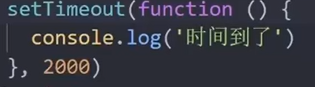
  - 清除延时函数
  - 返回值和定时器(间歇函数)一样是一个**数字型的id**

- js执行机制
  - 输出结果都是1/3/2
  - 
  - HTML5提出Web Worker标准，于是js中出现了**同步和异步**
  - **同步**：前一个任务结束后再执行后一个任务，程序的执行顺序与任务的排列顺序是一致的。同步任务都在**主线程**上执行，形成一个**执行栈**
  - **异步**：同时做几件事情，js的异步是通过**回调函数**实现的
    - 普通事件：如click、resize
    - 资源加载：如load、error
    - 定时器：setInterval、setTimeout
    - 异步任务相关添加到任务队列中(也称为消息队列)
  - 
  - web api由浏览器执行

#### location对象

- 它拆分并保存了url地址的各个组成部分
- href属性：通过赋值达到直接跳转的目的
- search属性：获取地址中携带的参数，符号'？'后面部分，用于获取表单提交内容
- hash属性：获取#后面部分即**a标签的锚点**，**不会刷新页面**就能有新的页面呈现
  - 

#### navigator对象

- 移动端

#### history对象

- 

### 本地存储

#### 本地存储介绍


#### 本地存储分类

- 
- 语法：
- 存储数据：key是名字，value是值，**键值对**
- 获取数据：
- 删除数据：
- **本地存储只能存储字符串**
- sessionStorage

#### 存储复杂数据类型

- 将复杂数据类型转换成JSON字符串，然后存储到本地
- 语法：**JSON.stringify(复杂数据类型)**
- 将字符串再转换为数组对象：**JSON.parse()**

#### map()数组方法

- map可以遍历数组处理数据，并且**返回新的数组**，是处理每一个数组元素，当不是利用变量时要加；号
- 
- 

#### join()数组方法

- join()方法用于把**数组中的所有元素转换一个字符串**
- 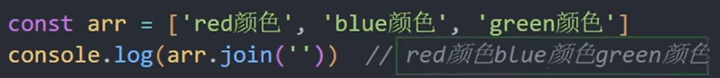
- 
- 小括号为空则以逗号“，”分割

#### forEach()数组方法

- forEach( )用于调用数组每一个元素，并将元素传递给回调函数，**不返回数组**，适合遍历数组对象
- 语法：当前数组元素必须写，索引号不是必须的
- 

#### filter数组方法

- 创建一个**新数组**，新数组的元素是通过检查**指定数组中符合条件**的所有元素
- 主要用于：**筛选数组符合条件的元素**，并返回筛选之后元素的**新数组**
- 语法
- 示例

## 正则表达式

- 介绍：正则表达式是用于匹配字符串中字符组合的**模式**。在js中正则表达式也是**对象**
- 通常用来**表单验证(匹配）、过滤敏感词(替换）、字符串中提取我们想要的部分(提取)**，许多语言都支持正则表达式

### 语法

- 第一步：定义规则；
- **const 变量名 = /表达式/**
- 第二步：是否匹配
- **变量名.test(被检测的字符串)**
- 
- **变量名.exec(被检测字符串)**
- 使用方法与test相同，但是返回的是**数组**，匹配失败返回null，数组的index代表检测字符出现的**数组下标**

### 元字符

- 普通字符：仅能描述他们本身例如字母和数字
- 元字符(特殊字符)：具有**特殊含义**的字符，提高了灵活性和强大的匹配功能
- 

#### 边界符

- 表示位置，开头和结尾，必须用什么开头，用什么结尾
- ^表示匹配**行首**的文本(以谁开始)
- $表示匹配**行尾**的文本(以谁结束)
- 如果是/^a$/那就必须是a才算匹配成功，因为这种写法就是**精确匹配**

#### 量词

- 表示重复次数，这个不仅划定次数，还要规定**只能是表达式里的字符**，结合其他符号使用
- 需要配合精确匹配才能正确，而且逗号左右不能有空格，大括号有就近原则，只重复最近的那一个

#### 字符类

- 比如\d表示0~9
- **[ ]匹配字符集合**，只匹配其中某一个**(只选一个）**，不需要全部匹配，如果加上精确匹配但是开头结尾不一样也是false
- "-" 连字符表示一个范围，比如[a-z]表示a到z26个英文字母，[a-zA-Z]表示大小写都可以，[0-9]表示数字
- [ ]里面加^是取反符号[ ^a-z]代表除了小写字符以外的字符
- **. **匹配除换行符之外的任何单个字符
- 预定义：指某些常见模式的简写方式

### 修饰符

- 修饰符约束正则执行的某些细节行为，比如是否区分大小写、是否支持多行匹配等
- 语法：/表达式/修饰符
- **i**是ignore的缩写，代表**不区分大小写**
- **g**是global的缩写，匹配**所有满足**正则的结果
- 在正则里面**或是|**，如[a|A]就是a或者A

修饰符中的方法替换

- replace：字符串.replace(/正则表达式/，’替换的文本‘)，只能改一个，所以需要加一个g才能全局替换
- 

# JS进阶es6

## 作用域

- 作用域规定了变量能够被访问的“范围”，离开了这个范围变量将不能再被访问

### 局部作用域

- 分为函数作用域和块作用域
- **函数作用域**
  - 在函数内部声明的变量只能在**函数内部**被访问，外部无法直接使用
  - 函数的**参数**也可以作为函数内部的局部变量
  - 不同函数内部声明的变量无法互相访问
  - 函数执行后变量就被清空了
- **块作用域**
  - 在JS中使用**{ }**包裹的代码被称为代码块，代码块内部声明的变量外部将【**有可能**】无法被访问
  - let声明的变量会产生块作用域，var不会产生块作用域
  - const 声明的常量也会产生块作用域
  - 不同代码块之间的变量无法互相访问
  - 推荐使用let和const

### 全局作用域

- script标签和.js文件就是全局作用域，在此声明的变量在函数内部也可以被访问。全局作用域中声明的变量，任何其他作用域都可以被访问
- 为window对象动态添加的属性默认值也是全局的，不推荐
- 函数中未使用任何关键字声明的变量为全局变量，不推荐
- 尽可能少使用全局变量，防止全局变量被污染

### 作用域链

- 作用域链的本质是**底层的变量查找机制**，在函数执行时会优先查找当前函数作用域中的变量，如果没有才会逐级查找父级作用域直到全局作用域
- **嵌套关系**的作用域**串联**起来形成了作用域链
- 相同作用域链中按着**从小到大**的规则查找变量
- 子作用域能够访问父作用域，父作用域无法访问子作用域

### JS垃圾回收机制

- 垃圾回收机制(Garbage Collection)简称GC
- JS中**内存的分配和回收**是**自动完成**的，内存在不使用的时候会被**垃圾回收器**自动回收

#### 内存的生命周期

JS环境中分配的内存，一般有如下生命周期

- **内存分配**：声明变量、函数、对象的时候，系统会自动为他们分配内存
- **内存使用**：即读写内存，也就是使用变量、函数等
- **内存回收**：使用完毕，由**垃圾回收器**自动回收不再使用的内存
- **全局变量**一般不会回收（关闭页面时回收）
- 一般情况下**局部变量**的值**不用会被自动回收**
- 内存泄漏：程序中**分配的内存**由于某些原因程序**未释放或无法释放**叫内存泄露

#### 算法说明

- 栈：由**操作系统自动分配释放**函数的参数值、局部变量等，基本数据类型放到栈里面
- 堆：一般由程序员分配释放，若程序员不释放，由**垃圾回收机制**回收，**复杂数据类型**放到堆里面

#### 引用计数法

- IE采用的算法，定义”内存不再使用“，就是看一个对象是否有指向它的引用，没有引用就回收
  - 1、跟踪记录**被引用的次数**
  - 2、如果被引用次数为1就记录为1，多次引用就++
  - 3、如果减少一个引用就--
  - 4、如果引用次数为0就释放内存
- 缺点：嵌套引用（循环引用）
  - 如果两个对象互相引用，尽管已经不会使用，垃圾回收器也不会进行回收，导致内存泄漏
  - 
  - 因为他们的引用次数永远不会是0 

#### 标记清除法

- 标记清除法将”不再使用的对象“定义为”**无法达到的对象**“
- 就是从**根部（在JS中就是全局对象）**出发定时扫描内存中的对象。凡是**能从根部到达的对象都是还需要使用的**
- 那些无法由根部出发触及到的对象被**标记为不再使用，稍后进行回收**

### 闭包

- 概念：一个函数对周围状态的引用捆绑在一起，内层函数中访问到其外层函数的作用域
- 闭包 = 内层函数 + 外层函数的变量
- 这就是一个闭包
- 闭包作用：封闭数据，提供操作，**外部也可以访问函数内部变量**
- 闭包基本格式
- 闭包应用：实现数据的私有。比如要做一个统计函数调用次数，函数调用一次就++

### 变量提升

- JS允许在变量声明之前即被访问（仅存在于var声明变量）
- 代码在执行前，内部将在**当前作用域的var全部提升到当前作用域最前面**不会提升到外面去，**只提升声明不提升赋值**

## 函数进阶

- 函数参数默认值、动态参数、剩余参数

### 函数提升

- 函数在声明之前可以被调用
- 代码在执行时会把**所有函数声明提升到当前作用域的最前面，只提升函数声明不提升函数调用**
- 注意

### 函数参数

#### 动态参数

- arguments是**函数内部内置的伪数组**变量，它包含了调用函数时传入的所有实参
- 

#### 剩余参数

- 剩余函数允许我们将一个**不定数量**的参数表示为一个**数组**
- 
- ...是语法符号，在函数形参最后，用来获取多余参数即前面还可以有参数，**剩下的才给...other**
- ...other接到的数转换成了**名字是other**的**真数组**

### 展开运算符

- 展开运算符（...）用来将一个数组进行展开如...arr就是arr的所有元素
- 不会修改原数组
- **常用场景**
  - 求数组最大值Math.max(...arr)，最小值就是min
  - 合并数组：const arr = [...arr1，...arr2]

### 箭头函数

- 目的：引入箭头函数是为了让函数更简短且不绑定this，箭头函数的语法比函数表达式更简洁
- 箭头函数更适用于那些**本来需要匿名函数的地方**

#### 基本语法

- 只有一个**形参**时可以省略箭头前面的**括号**，只有一行代码时可以**省略大括号**，只有**一行return**时可以省略**return和大括号**
- 直接返回一个对象， 当只有一行代码省略return和大括号却**要返回对象**时，因为对象自己有大括号，所以为了**区别对象和函数体，就要加一个小括号**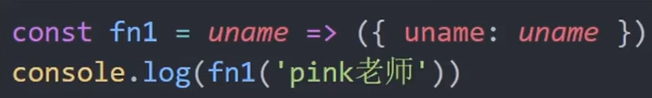

#### 箭头函数参数

- 箭头函数**没有arguments动态参数**，但是有**剩余参数**

#### 箭头函数this

- 箭头函数不会创建自己的this，它只会从自己的**作用域链的上一层沿用this**
- 对象方法箭头函数this
  - 
  - 

## 解构赋值

### 数组解构

- 数组解构是将**数组的单元值(数组元素)**快速批量赋值给一系列**变量**的简洁**语法**
- 基本语法
  - 左侧的[ ]用于**批量声明变量**，右侧数组的单元值将被**赋值**给左侧的变量
  - 变量的顺序对应数组单元值的位置依次进行赋值操作
  - 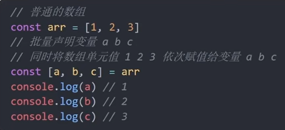
  - 交换变量，**交换前必须有一个分号**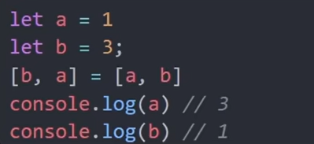
  - 单元值少，变量多会出现undefind；单元值多就按顺序赋值
  - 特殊的，单元值多可以使用**剩余参数...arr**
  - 可以在声明时先在中括号里面赋值，防止赋值失败出问题
  - 按需导入，忽略某些返回值
  - 多维数组解构

### 对象解构

- 将对象**属性和方法**快速批量赋值给一系列变量的简洁语法
- 基本语法
  - 1、赋值运算符 = 左侧的{ }用于批量声明变量，右侧对象的属性值将被赋值给左侧的变量
  - 2、对象属性的值将被赋值给与**属性名相同的变量**，可以改名语法为——**旧变量名：新变量名**
  - 3、注意解构的变量名不要和外面的变量名冲突否则报错
  - 4、对象中找不到与变量名一致的属性时变量值为undefined
  - 

- 数组对象解构
  - 
  - 多级解构
  - 通过对象解构{data}达到只获得对象里面的data的数据

### 案例

- 给list标签(列表)里面加div
- 筛选元素

## 构造函数

### 深入对象

#### 创建对象三种方式

- 利用字面量创建对象

  - ~~~js
    const obj = {
    	name: '佩奇'
    }
    ~~~

- 利用new Object 创建对象

  - ~~~js
    const obj = new Object({name: '佩奇'})
    ~~~

- 利用**构造函数**创建对象

#### 构造函数

- 一种特殊的函数，用来初始化对象
- 构造函数可以快速创建多个类似的对象
- 约定命名由大写字母开头，只能以new操作符执行（表示是构造函数）

#### 实例化执行过程

- 1、创建**新空对象**
- 2、构造函数**this指向新对象**
- 3、执行构造函数代码，修改this，添加新属性
- 4、返回有数据的新对象
- 

#### 实例成员和静态成员

- 实例成员：通过**构造函数**创建的**对象**称为**实例对象**，实例对象中的**属性和方法**称为**实例成员**
  - 为构造函数传入**参数**，创建**结构相同但值不同**的对象
  - 构造函数创建的实例对象**彼此独立**互不影响
  - 

- 静态成员：**构造函数**的**属性和方法**称为**静态成员**(静态属性和静态方法)
  - 
  - 静态成员只能构造函数来访问
  - 静态方法中的**this指向构造函数**
  - 比如Date.now()，Math.PI，Math.random()

### 内置构造函数

- JS底层将**简单数据类型**包装成了**引用数据类型**(对象)
- 引用数据类型：Object、Array、RegExp(正则)、Date
- 包装类型：String、Number、Boolean

#### Object

- 内置的构造函数，用于创建普通对象

- ~~~js
  const user = new Object({name: 'xxx', age: 15})
  ~~~

- 推荐使用字面量声明对象，而不是这个

- Object.keys()静态方法获取对象中的所有**属性名**，**返回数组**

  - ~~~js
    const O = {name: 'pp', age: 6}
    const arr = Object.keys(O)
    //arr就是一个数组，里面存着对象的属性名
    ~~~

- Object.values()获得所有**属性值**，**返回数组**

  - ~~~js
    Object.values(O) //同样返回的数组，里面存的属性值
    ~~~

- Object.assign用于对象拷贝，**返回一个拷贝后的新对象**

  - ~~~js
    const O = {name: 'pp', age: 6}
    const obj = {}
    Object.assign(obj, O)
    //此时的obj就是一个内容与O相同的对象了
    ~~~

  - 常用于给对象添加属性

- 案例

#### Array

- Array是内置的构造函数，用于创建数组

- 

- reduce返回累计处理的结果，经常用于求和

  - 基本语法：主要是两个参数，一个回调函数，一个初始值

  - ~~~js
    arr.reduce(function() {}, 初始值)
    ~~~

  - 没有初始值

  - 有初始值

  - 可以使用箭头函数

  - **reduce执行过程**

  - 对于数组对象的求和要注意数据类型

- 还有一个arr.fill(新元素， 1）意思是从下标为1处开始数组元素全部改为新元素

- find：arr.find(function (当前数组元素item) {return ltem === 'ccc'})，找到第一个就返回
- every：(some语法一样，但是有一个满足就返回）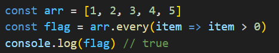
- from将伪数组转换为真数组，Array.from(arr)就将arr转换成了真数组
- **数组扁平化：数组名.flat(n)，将嵌套数组打开，n表示打开几层**
- **数组名.slice(start, end)**，左闭右开，两个参数都是可选的，若为负数则倒着复制，返回一个含有被提取元素的新数组。

#### String

- String()直接使用转字符串
- 变量名.toString()也强制转换成字符串
- 
- **split**把字符串转换为数组，与join相反
  - 案例
- **substring**截取两个索引号之间的字符串并返回这个子集字符串，**左闭右开**

- **startWith**，检测是否某个字符（空格也算）开头，返回bool值
- **includes**检测是否包含某个字符

#### Number

- Number()转换成数字
- **toFixed()**设置保留小数位的长度，**默认整数，会四舍五入**，也可以给整数保留小数
- 注意精度问题，需要将小数转换成整数再比较计算

## 深入面向对象

### 编程思想

- **面向过程介绍**：分析出解决问题所需要得步骤，然后用函数把这些步骤一步一步实现，使用的时候再一个一个依次调用

  - 优点：**性能比面向对象高**，适合跟硬件联系紧密的东西
  - 缺点：没有面向对象容易维护、复用、扩展

- **面向对象介绍**：把事务分解成为一个个对象，然后由对象之间分工与合作。面向对象是以对象功能来划分问题，不是步骤

  - 面向对象编程（oop）
    - 每一个对象都是功能中心，具有明确的分工
    - 面向对象编程具有灵活、代码可复用、容易维护和开发的优点
    - 特性：**1.封装性；2.继承性；3.多态性**

  - 易维护、易复用、易扩展，由于有**封装、继承、多态性**的特性，可以设计出低耦合的系统，使系统更加灵活、更加易于维护
  - 缺点：性能低

### 构造函数

- 实现了封装性
- 缺点：**浪费内存**，如果声明了两个对象，同时有一个相同的方法，那么就会创建两个方法重复申请了内存

### 原型

#### 原型

- 就是**构造函数的一个属性**（prototype），它指向一个对象即具有对象的性质
- 利用原型对象实现**方法共享**
- 构造函数通过**原型分配的函数**是**所有对象所共享的**
- JS规定**每一个构造函数都有一个prototype属性**，指向另一个对象，所以称为原型对象
- 这个对象可以挂载函数，对象实例化不会多次创建原型上的函数，节约内存
- 我们可以把**相同的方法**直接定义在**prototype对象**上，这样可以所有**对象的实例共享**这个方法
- **构造函数和原型对象中的this**都指向**实例化的对象**
- 公共的属性写到构造函数，公共的方法写到prototype（原型对象）里
- 构造函数和原型对象里的this指向的还是**实例对象**
- 案例：数组扩展方法
  - 
  -         

#### constructor属性

单词意思就是构造函数

- 每个原型对象里面都有一个constructor属性（constructor构造函数）
- 该属性**指向**该原型对象的**构造函数**
- 使用场景：如果给原型对象**以对象的形式加了多个方法**，那么constructor将**不再指向构造函数**，所以在创建原型对象时添加一个**constructor指向原来的构造函数**。理解为给原型对象**重新赋值**了，里面的其他属性包括constructor没有了，所以必须**追加**constructor指向原构造函数
- 

#### 对象原型

- **实例对象都会有一个属性_proto__指向构造函数的prototype原型对象**，之所以实例对象可以使用构造函数prototype原型对象的属性和方法就是因为对象有这个原型存在。**对象原型指向原型对象**
- 
- 在原型里还有constructor指向构造函数

#### 原型继承

- 继承是面向对象编程的另一个特征，通过继承进一步提升代码封装程度，JS常用原型对象继承
- 通过原型继承对象需要将**constructor指回去**，但是在给**某一个实例对象的原型对象添加属性或方法**时会将**所有继承这个原型**的实例对象全部更改，因为他们的**对象函数（指针）指向同一个原型**
- 注意代码顺序，一定要**先操作完**以后再**声明实例对象**

#### 原型链

- 原型链就是一个查找规则，**只要是对象就有proto**
- 主要指**proto形成的链**，从实例对象的对象原型**往上**找，直到Object的**prototype**，**Object.prototype的对象原型指向null**
- 
- 
- instanceof：检测元素在不在原型链上，可以是对象或者数组

## 高阶技巧

### 深浅拷贝

#### 浅拷贝

- 拷贝**栈里面的东西**，就是**简单数据类型和引用数据类型的地址**，所以新变量改简单数据不会改旧的，但是改**引用数据类型**就会把旧的那个也改了
- 修改拷贝后的**新变量不会改变旧的值**(仅限于**最外层即直接的简单数据**，如果**对象套对象**那么**内部对象也会被更改**)
- 常见方法
  - 1、拷贝对象：**Object.assign()或{...obj}**
  - 2、拷贝数组：**Array.prototype.concat()或者[...arr]**

#### 深拷贝

- 直接拷贝对象，不涉及地址
- 常见方法
  - **通过递归实现深拷贝**
  - **lodash/cloneDeep**
  - **通过JSON.stringify()实现**

- 1、递归
  - 函数递归：一个函数在内部调用自己就是递归，必须先判断数组再判断对象，因为数组也是对象

- 2、JS库lodash里面的cloneDeep
  - 要引用lodash库，引用lodash.min.js文件库
  - _.cloneDeep(obj)深拷贝

- **3、用JSON.stringify()和JSON.parse()**

### 异常处理

- 异常处理指预估代码执行过程中可能发生的错误，然后最大程度的避免错误的发生导致整个程序无法运行

#### throw抛异常

- 两种方法都可以，注释的这个不会报行数，第二个会报行数，**程序会中止**

#### try/catch捕获异常

- 通过try和catch捕获错误信息(浏览器提供的错误信息)，try试一下代码，catch拦住，finally最后
- 

#### debugger

- 写在代码里（直接写）会自动跳转到调试台打断点

### 处理this

#### **this指向**

- 普通函数this指向
  - 谁调用指向谁，全局的最外层是window
  - 如果在当前作用域加上'use strict'开启严格模式，必须要加this的调用者否则就是undefind
- 箭头函数this指向
  - 事实上箭头函数没有this
  - 

#### **改变this**

- 三个方法**都有返回值**

- call()

  - 语法：
  - 
  - 

- **apply()**

  - 主要操作数组
  - 求最大值的另一个方法

- **bind()**

  - **不会调用函数**，但是可以改变函数内部this指向，连续多次调用 `bind` 方法，最终函数的 `this` 上下文是由**第一次调用 bind 方法**的参数决定的

  - ~~~js
    const obj1 = { name: 'obj1' };
    const obj2 = { name: 'obj2' };
    const obj3 = { name: 'obj3' };
    
    function getName() {
      console.log(this.name);
    }
    
    const fn1 = getName.bind(obj1).bind(obj2).bind(obj3);
    fn1(); // 输出 "obj1"
    ~~~

  - 

  - 案例，**bind的btn也可以改为this**

### 防抖（debounce）

- 单位时间内，频繁触发事件，**只执行最后一次**（类似于王者回城）。**一直触发则一直不执行**，简单来说就是在500ms内被触发只执行最后一次，过了500ms才开始再次触发
- 使用场景：1、搜索框搜索输入，只需要用户最后一次输入完再发送请求；2、手机号、邮箱验证输入检测
- 实现方式：1、lodash提供的防抖处理；2、手写防抖函数
- **引入lodash库**
  - 

- **手写防抖函数**

  - mouseMove是自己写的函数，表示要执行的操作，必须把核心算法返回，因为事件里面调用函数只调用一次

  - ~~~js
    <script>
      // 显示数字
      let i = 1
      // 每次执行代码
      function mouseMove() {
        document.querySelector('span').innerHTML = i
        i++
      }
      // 防抖函数
      function def(fn, t) {
        // 定时器变量用于清除定时器
        let time
        // 必须返回函数，因为下面只调用了一次函数，无法一种存在涉及闭包
        return function () {
          // 如果前面重复触发了事件，则清除定时器
          if (time) 
          {
            clearTimeout(time)
          }
          // 重新设置定时器，延时t毫秒后调用函数
          time = setTimeout(function () {
            fn()
          }, t)
        } 
      }
      // 绑定事件
      document.querySelector('.outer').addEventListener('mousemove', def(mouseMove, 500))
    </script>
    ~~~

### 节流（throttle）

- 单位时间内**频繁触发事件，只执行一次，只要触发一次就会执行，但是在设定时间里严格只执行一次**，简单来说就是在500ms内不管触发多少次只执行第一次
- 使用场景：1、鼠标移动mousemove；2、页面尺寸缩放resize；3、滚动条滚动scroll
- 实现方式：1、lodash提供的节流函数；2、手写一个节流函数处理
- **引入lodash库**
  - 

- **手写节流**

  - 

  - ~~~js
    let i = 1
    function mouseMove() {
      document.querySelector('span').innerHTML = i++
    }
    function tol(fn, t)
    {
      let time = null
      return function() {
        if (!time)
        {
          time = setTimeout(function () {
            fn()
            time = null
          }, t)
        }
      }
    }
    document.querySelector('.outer').addEventListener('mousemove', tol(mouseMove, 3000))
    ~~~

  - **在定时器里面清除定时器不能用clear，此时定时器还在运作，只能赋值为null**

- 案例
  - 存储上一次视频时间
  - 更改时间

## 内存泄漏

- **意外的全局变量**：由于使用未声明的变量，而意外的创建了一个全局变量，而使这个变量一直留在内存中无法被回收。

- **被遗忘的计时器或回调函数**：设置了setInterval定时器，而忘记取消它，如果循环函数有对外部变量的引用的话，那么这个变量会被一直留在内存中，而无法被回收。

- **脱离 DOM 的引用**：获取一个 DOM 元素的引用，而后面这个元素被删除，由于一直保留了对这个元素的引用，所以它也无法被回收。

- **闭包**：不合理的使用闭包，从而导致某些变量一直被留在内存当中。

# vue2

- vue是一个用于构建用户界面的渐进式框架
- 

## vue上手

### 创建vue实例

核心步骤

- 容器就是vue所管理的范围

- 重点在div里面那个变量名以及实例里面获取选择器

### 引包

- vue2官网是https://v2.cn.vuejs.org

- 可以下载文件，也可以通过在线链接script引入，一旦引入了vuejs核心包在全局环境就有了vue构造函数

- ~~~js
  <script src="https://cdn.jsdelivr.net/npm/vue@2.7.16/dist/vue.js"></script>
  ~~~

### 插值表达式

- {{ }}，一种vue的模板语法
- 表达式：可以被求值的代码，js引擎可以将其计算出一个结果
- 作用：利用表达式进行插值，渲染到页面中
- 语法：{{ 表达式 }}
- 注意：1、使用的数据必须存在(data)；2、支持的是表达式，而非语句，比如if、for；3、不能在标签属性中使用{{ }}插值

### 响应式特性

- 数据的响应式处理：**数据变化，视图自动更新**
- 修改数据：

- 响应式就是数据改变，视图自动更新，只需要专注于业务核心逻辑

## Vue指令

- vue会根据不同的**指令**，针对**标签**实现不同的**功能**
- **指令：**带有**v-前缀**的特殊**标签属性**，写在标签属性里面

- v-html的作用就是**动态**的innerHTML，**语法v-html = "表达式"**

- https://v2.cn.vuejs.org，查询14个指令
- v-show
  - 作用：控制元素显示隐藏
  - 语法：v-show="**表达式**"，**表达式值true显示，false隐藏**
  - 机制：通过css将**display改为none**隐藏元素
  - 场景：**频繁切换**显示隐藏的场景

- v-if
  - 作用：控制元素显示隐藏（**条件渲染**）
  - v-if="**表达式**"，**表达式值true显示，false隐藏**
  - 机制：直接控制**元素的创建和移除**
  - 场景：要么显示，要么隐藏，不频繁切换的场景

- v-else
  - 否则，**不用跟内容**
  - 需要**紧挨着v-if**一起使用
- v-else-if
  - v-else-if="表达式"
  - 需要**紧挨着v-if**一起使用
  - 

- v-on

  - 作用：注册事件 = **添加监听 + 提供处理逻辑**
  - **语法1**
    - v-on:事件名 = "内联语句"
    - v-on可以替换为@
    - 
  - **语法2**
    - v-on:事件名 = "methods中的函数名"
    - 创建vue实例时，可以创建一个函数
    - 注意：添加的methods方法里面的函数最好用**this**获取到data的值，而且不能直接就是一个函数，需要是方法

  - **调用传参**：在利用函数名时改为函数调用如**v-on:click="fn(参数1，……)"或者@click="fn(参数1，……)"**

  - ~~~js
    <div id="app">
      <button v-on:click="buy(5)">可乐5元</button>
      <button v-on:click="buy(10)">大可乐10元</button>
      <span>{{ money }}</span>
    </div>
    <script src="https://cdn.jsdelivr.net/npm/vue@2.7.16/dist/vue.js"></script>
    <script>
      const app = new Vue({
        el: '#app',
        data: {
          money: 100
        },
        methods: {
          buy (price) {
            this.money = this.money - price
          }
        }
      })
    </script>
    ~~~

- v-bind
  - 作用：动态设置html的标签属性
  - 语法：v-bind:**属性名**="表达式"
  - 如v-bind:src="url"，可以**简写为:src**
  - 案例：

- v-for

  - 作用：基于数据循环，多次渲染整个元素；常用于**数组**、对象、数字

  - 遍历数组语法：v-for=**"(item, index) in 数组名"**，item是当前元素，index是数组下标，index可以**省略**，如果只有一个参数时**括号也可以去除**

  - key

    - 
    - **不加key**删除的不是真正要删的元素，而是**原地修改元素（就地复用）**，删的后面，然后将内容替换过去了
    - 注意key只能是**字符串或者数字类型**；key的值必须**要唯一**；推荐使用id作为key不推荐使用下标（会变化）

  - ~~~js
    <ul id="fut">
      <li v-for="item in fr">
        <span>{{ item.name }}</span>
        <span>{{ item.book }}</span>
        <button @click="fn(item.id)">删除</button>
      </li>
    </ul>
    <script src="https://cdn.jsdelivr.net/npm/vue@2.7.16/dist/vue.js"></script>
    <script>
      const fru = new Vue ({
        el: '#fut',
        data: {
          fr: [
            {id: 1, name: '曹', book: '红'},
            {id: 2, name: '罗', book: '三'},
            {id: 3, name: '吴', book: '西'},
          ],
        },
        methods: {
          fn (id){
            this.fr = this.fr.filter(item => item.id !== id)
          }
        }
      })
    </script>
    ~~~

- v-model

  - 作用：给**表单元素**使用，**双向数据绑定**，可以快速**获取或设置**表单元素内容

  - 特点：数据变化让视图自动更新，同时**视图变化数据也会自动更新**
  - 
  - 

## 指令补充

### 指令修饰符

- 通过" **.** "指明一些指令**后缀**，不同**后缀**封装了不同的处理操作用于简化代码
- 按键修饰符：@keyup.enter —> 键盘**回车**监听
- v-model修饰符
  - **v-model.trim**用于去除**首尾空格**
  - v-model.number用于**转数字**
- 事件修饰符
  - @事件名.stop用于阻止冒泡
  - @事件名.prevent用于阻止默认行为

### v-bind对于样式操作的增强

- 操作类：class类名、style行内样式

- 语法：:class="对象/数组"

  - 
  - 对象适用场景：一个类名**来回切换**
  - 数组适用场景：批量**添加或删除**类

- ~~~js
  //案例  
  <ul class="all">
      <li v-for="(item, index) in list" :key="index" @click="addindex = item.id">
        <span :class="{active: addindex === item.id}">{{ item.name }}</span>
      </li>
    </ul>
  
    <script src="https://cdn.jsdelivr.net/npm/vue@2.7.16/dist/vue.js"></script>
    <script>
      new Vue({
        el: '.all',
        data: {
          addindex: 0,
          list: [
            {id: 1, name: 'a'},
            {id: 2, name: 'b'},
            {id: 3, name: 'c'}
          ]
        }
      });
  ~~~

- 语法：**:style="样式对象"**

### v-model应用于其他表单元素

- 输入框—input:text；文本域—textarea；复选框—input:checkbox；单选框—input:radio；下拉菜单—select……
- 

## computed计算属性

- 概念：基于**现有的数据**，计算出来的**新属性**，依赖的数据变化，自动重新计算

### 基础语法

- 声明在**computed配置项**中，一个计算属性对应一个函数
- 使用起来和普通属性一样使用{{ 计算属性 }}，**不需要加括号**
- 

### computed计算属性 vs methods方法

- computed计算属性
  - 作用：封装了一段对于数据的处理，求得一个**结果**
  - 语法：写在**computed**配置项中；作为**属性**，直接使用**this.计算属性/{{ 计算属性 }}**
  - 数据变化才会重新计算，数据不变化就不会再次执行

- methods方法
  - 作用：给实例提供一个**方法**，调用以**处理业务逻辑**
  - 语法：写在**methods**配置项中；作为**方法**，需要调用**this.方法名( ) / {{ 方法名( ) }} / @事件名="方法名"**

### 计算属性的完整写法

- 上面的默认写法只是简写，**只能访问，不能修改**
- 完整写法可以修改
- 

### 成绩案例

- 

## watch侦听器（监视器）

- 作用：**监视数据变化**，执行一些业务逻辑或异步操作

### 基础语法

- 简单写法用于**监视简单数据类型**，直接监视
- 注意数据类型名要和data中**一致**，对象里面的子属性需要**加引号**

### 完整写法

- 可以添加额外**配置项**
- **deep:true**对复杂类型深度监视
  - 数据属性名就是对象名，handler配置的是方法
- **immediate:true**因为handler只会在修改内容时触发，如果想**一进页面马上执行**就需要加上

## vue生命周期

- 一个vue实例从创建到销毁的整个过程

### 四个阶段

- 创建
  - 将普通数据转换为响应式数据
  - 创建完成后才可以发送初始化渲染请求
- 挂载
  - 渲染模板，将数据写入标签元素
  - 操作dom
- 更新
  - 数据修改，更新视图（是一个循环，可以反复执行）
- 销毁
  - 关闭页面，销毁实例

### 生命周期钩子

- 在生命周期中自动运行的函数，一共八个函数，一个阶段两个
- 
- 通过created发送初始化渲染请求，mounted操作dom
- **数据更新**才会执行第三个阶段的两个钩子，beforeUpdate是**更新之前**的数据，update是**更新之后**的数据
- 同样beforeDestroy是之前，destroyed是之后，在**控制台**可以通过**类名.$destory()**来清除，但是页面依旧显示但是无法使用，常用于消除**定时器和全局事件监听**

## 工程化开发入门

### 核心包传统开发模式

- 基于HTML/CSS/JS文件，直接引入核心包，开发vue

### 工程化开发模式

- 基于构建工具（例如webpack）的环境中开发vue
- 源代码—>自动化编译压缩组合—>运行的代码

### 脚手架vue CLI

- vue CLI是vue官方提供的一个**全局命令工具**，可以帮助我们**快速创建**一个开发vue项目的**标准化基础架子**（集成了webpack配置）
- 
- 
- 

### 组件化

- main.js中

- ~~~js
  //导入APP.vue，基于APP.vue创建结构渲染index.html
  //1.引入了vue核心包
  //2.导入了App.vue根组件
  import Vue from 'vue'
  import App from './App.vue'
  
  //用于提示处于生产环境还是开发环境
  Vue.config.productionTip = false
  
  //vue实例化，提供render方法，基于App.vue创建结构渲染index.html
  new Vue({
    render: h => h(App),
  }).$mount('#app')
  //与下面这个作用一样
  
  new Vue({
    el: '#app',//作用与$mount(#app)一致
    //render: h => h(App),
    //完整写法是
    render: (createElement) => {
      return createElement(App)
    }
  })
  ~~~

- 一个页面可以拆分成**一个个组件**，每个组件有着自己独立的**结构、样式、行为**
- 好处：便于**维护**，利于**复用**，提升了**开发效率**
- 
- App.vue文件有三个组成部分
  - template：结构**有且只能有一个**根元素，即不能并列多个元素（只是vue2的问题）
  - script：js逻辑，导出的是当前组建的配置项，里面可以提供data（特殊）、八大钩子、methods、computed、watch
  - style：样式（可支持less，需要装包：lang="less"，安装依赖包：yarn add less less-loader -D）
  - 

### 普通组件的注册使用

#### 局部注册

- 只能在注册的组件内使用

- 1、创建**.vue文件**（三个组成部分），在components文件夹创建，命名为HmFooter、HmHeader、HmMain文件

- 2、在使用的组件内导入并注册

- 

- 使用：当作**html标签**使用<组件名></组件名>

- 注意：大驼峰命名法

- ~~~vue
  <template>
    <div class="out">
      <!-- 头部组件，使用组件否则报错 -->
      <CtHeader></CtHeader>
    </div>
  </template>
  
  <script>
  //导入组件
  import CtHeader from './components/CtHeader'
  export default {
    components: {
      // 组件名：组件对象，一般来说要一致
      CtHeader: CtHeader
    }
  }
  </script>
    
  <style>
    .out {
      width: 500px;
      height: 600px;
      background-color: skyblue;
      margin: 0px auto;
      padding: 20px;
    }
  </style>
  ~~~

#### 全局注册

- 所有的组件内**都能使用**
- 创建.vue文件，在**main.js**中进行全局注册
- 

## 组件三大部分

- 结构/样式/逻辑

### scoped样式冲突

- 默认情况是全局样式，容易造成多个组件之间的样式冲突问题
- 全局样式：默认组件中的样式会作用到全局
- 局部样式：给组件<style scoped>加上scoped属性，这样就可以**只作用于当前组件**
- 原理：给当前组件加上了一个**自定义属性data-v-hash**，每个组件hash值不一样，通过**hash值区分不同组件** === css选择题后面被自动处理，添加上了[data-v-hash值]的属性选择器

### data是一个函数

- el是根实例独有的
- 组件的**data**选项必须是一个**函数**，其他配置项一致，保证每个组件实例，维护**独立**的一份数据。每次创建新的组件实例，都会**新执行一次data函数，得到一个新对象**。意思就是如果不同组件取了同一个名字但是是不会互相影响的

## 组件通信

- 组件与组件之间的数据传递
- 组件的数据是独立的，无法直接访问
- 组件的关系有：父子关系，非父子关系

### 组件通信语法

- 父子关系用props和$emit
- 非父子关系用provide&inject和eventbus
- 通用解决方案：Vuex（适合复杂业务场景）

### 父传子

- 
- 
- props校验
  - 作用：为prop指定验证要求，不符合要求控制台就报错
  - 语法
    - 1、**类型校验**
    - 2、非空校验
    - 3、默认值
    - 4、自定义校验

### 子传父

- 在传过来时拿到了数据，所以newTitle就是新数据

### prop&data单向数据流

- **谁的数据谁负责**
- 共同点：都可以给组件提供数据
- 区别
  - data的数据是组件自身的，随便改
  - prop的数据是外部的，不能直接改，要遵循单向数据流
- 单向数据流：父级prop的数据更新，会向下流动影响子组件，这个数据流动是单向的

### 综合案例

- 

### 非父子通信

#### 事件总线

- 作用：非父子组件之间，进行简易消息传递
- Event Bus就是一个**媒介**，放到公共文件，$on就是在**事件监听**，utils工具文件夹，EventBus.js就是事件总线文件，创建了实例后用export导出

#### 跨层级（provide&inject）

- 作用：跨层级共享数据
- 传输复杂类型时用**对象做成响应式**，可以改变
- 

## 进阶语法

### v-model原理

- 原理：本质是一个**语法糖**，例如**应用在输入框上**，就是**value属性和input事件**的合写，复选框就不一样
- 作用：提供数据的**双向绑定**
- 注意：$event用于在模板中**获取事件的形参**
- 数据变，视图跟着变**:value**；视图变，数据跟着变**@input**

### v-model应用于组件

将表单类组件封装，用v-model简化代码

#### 表单类组件封装

- 父传子：数据应该是**父组件props**传递过来，v-model**拆解**绑定数据
- 子传父：监听输入，子把值传给父组件进行修改
- 

#### 表单案例

- 

#### 利用v-model进行表单类组件封装

- 父组件用**v-model简化代码**，实现子组件和父组件数据**双向绑定**
  - 子组件中：**props**通过**value**接收，事件触发**input**
  - 父组件中：**v-model**给组件**直接绑数据**
- 父组件改为v-model，记得子组件要改为**value接收值，input事件触发**

### sync修饰符实现双向绑定

- 作用：实现**子组件和父组件**数据的**双向绑定**，简化代码
- 特点：props**属性名可以自定义**，非固定为value
- 场景：封装弹框类的基础组件，**visible属性true显示，false隐藏**
- 本质就是将**传值与事件监听**实现了，**虚线上下作用相同**

### ref和$refs

#### 操作dom

- 作用：利用ref和$refs可以用来获取**dom元素或组件实例**
- 特点：查找范围 —> **当前组件内**（更精确稳定）
- querySelector是全局查找
- 获取dom
  - 目标标签添加ref属性：ref="名字"
  - 使用时通过this.$refs.名字使用
- 

#### 获取组件实例

- 获取组件
  - 目标组件：添加ref属性
  - 调用时通过this.$refs.名字获取目标组件，就可以**调用组件对象里面的方法**
- 子组件里面要提前设置**数据的双向绑定v-model**

### Vue异步更新和$nextTick

- 

- $nextTick：**等DOM更新后**，才会触发执行此方法里的函数体
- 语法：**this.$nextTick(函数体)**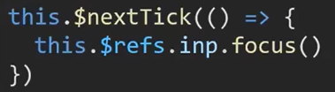

## 自定义指令

前面学的指令都是**内置指令**，还可以自定义指令**封装一些dom操作**，扩展额外功能

### 基本语法（全局&局部注册）

#### 全局注册

- 写入钩子，inserted表示在当前元素被**插入页面**就会执行。**写到main.js主文件夹**

#### 局部注册

- 

#### 使用

- 

### 指令的值

- 语法：在绑定指令时，可以通过"等号="的形式为指令**绑定具体的参数值**
- 
- 通过**bindling.value**可以拿到指令值，指令值修改会**触发update函数**
- 案例

### 自定义指令没有响应式

- 利用update钩子做响应式，即可以在vue插件控制台修改数据

### v-loading指令封装

- 场景：实际开发过程中，**发送请求需要时间**，在请求的数据未回来时，页面会处于**空白状态**
- 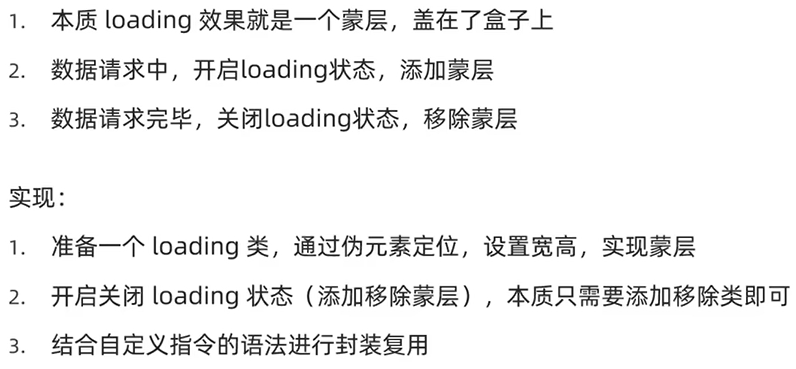
- 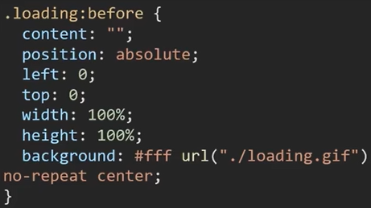

- 核心思路

## 插槽

就分为**默认插槽**（组件内定制一处结构）和**具名插槽**（组件内定制多处结构）

### 默认插槽

- 让组件内部的一些**结构支持自定义**，可以达到组件里面的内容自定义，比如某些弹出的提示框，提示内容不一样。只能**定制一个内容**，如果一个组件多个定制要用具名插槽
- 语法
  - **子组件内需要定制**的结构部分，改用**slot**标签占位
  - 在**父组件结构**里面使用组件MyDialog时，标签内部写内容或者标签就可以替换slot标签
  - 

### 后备内容（默认值）

- 给slot插槽设置预备内容
- 语法：在**slot里面写内容**就是默认内容<slot>写内容</slot>

### 具名插槽

- 1、多个slot使用**name属性**区分名字
- 2、**template**配合**v-slot:**名字来对应标签
- **v-slot:可以简写为#**

### 作用域插槽

- 是插槽的一个传参语法
- 定义slot插槽的同时是可以**传值**的，给插槽上可以**绑定数据**，将来**使用组件**时可以使用
- 场景

- 使用步骤，slot传的数据是一个对象，被obj获取了，如果是具名插槽就不是default

## 单页应用程序

- 简称SPA-Single Page Application，所有功能在一个html页面上实现，**页面按需更新**
- 单页面应用vs多页面应用

- 按需更新：明确**访问路径和组件**的对应关系

## 路由

- vue中的路由（VueRouter）：**路径和组件**的**映射**关系
- 作用：**修改**地址路径时，**切换显示**匹配的**组件**
- Vue官方的一个路由插件，是一个第三方包https://v3.router.vuejs.org/zh/

### VueRouter的使用（5+2）

- 基础步骤（固定），写在**main.js**里面

- 核心步骤（使用），**router-view**就是到时候组件出现的**位置**，放导航栏上面到时候就会在上面显示，**配置路由规则写在main.js（大项目可以拆出来）**
- 

## 组件存放目录

### 组件分类

- **页面组件**—页面展示—配合**路由**用，src/views文件夹
- **复用组件**—展示数据—常用于**复用**，src/components文件夹

## 路由进阶

### 路由的封装抽离

- 新建文件夹，然后在main.js文件里面导入再注入router，再index.js文件里面**要导入vue和页面组件，还要导入export default router，记得更改组件文件路径**
- 拆分模块，利于维护
- 快速引入组件时可以使用**@指代src目录替代../**，从src目录出发

### 声明式导航/导航高亮

#### 基本使用

- vue-router提供了一个**全局组件router-link（导航链接/声明式导航）取代a标签**
- 
- 语法是
- 设置高亮是通过**实现的类**来操作，在控制台看得到**两个类**，随便哪一个都行，在识别时会把这个标签**识别为a标签**

#### 两个类


- 模糊匹配
  - router-link-active是**常用的模糊匹配**
  - 当使用to="/my"时可以把**/my下面的全部匹配**，不论是/my/a还是/my/b（嵌套时）
- 精确匹配
  - router-link-exact-active是精确匹配
  - 只能匹配写的那个文件即to="/my"**只能匹配/my**

#### 自定义高亮类名

- 几乎不用

### 声明式导航跳转传参

#### 查询参数传参

- 语法
  - to="/path**?参数名=值**"
  - 对应**页面**接收传值时用{{ **$route.query.参数名** }}做成响应式数据
  - 发送请求时在**script的created钩子**中获取路由参数**this. $route.query.参数名** 

#### 动态路由传参

- 语法
  - 1、配置动态路由，:words是动态的，以后这个search路径下面的都可以被获取
  - 2、配置导航链接——**to="/path/参数值"**（path是路径的意思，就是文件路径）
  - 3、对应页面组件接收传递过来的值——**$route.params.参数名**（这里的参数名就是第一步里面那个动态名字）
- 两种传参的区别

- 问题，如果使用动态传参会出现跳转页面是空白的情况
  - 原因：动态传参默认必须要传参数
  - 解决方法：在配置路由时在参数名后面加一个问号？即**path: '/search/:words?'**

### 路由重定向（页面一打开的视图）

- 问题：网页打开，url默认是 / 根路径，未匹配到组件时，会出现空白
- 说明：重定向指**匹配path**后强制**跳转path路径**
- 语法：

### 路由404

- 作用：当路径找不到匹配时，给个提示页面
- 位置：配在路由最后
- 语法：path："*"（任意路径）前面不匹配就命中最后这个

### 路由模式

- 路由的路径有#号，主要是以为hash由a标签锚点跳转所以有#
- 
- 语法

### 编程式导航-跳转与传参

- 作用：用**js代码**实现点击按钮实现跳转的功能

#### path路径跳转

- 上面是简写，下面是完整语法
- **查询参数传参**，同样是加问号或者用query写成详细的传参，使用时依旧用{{ **$route.query.参数名** }}
- **动态路由传参**，使用时用**$route.params.参数名**
- 在传值时可以通过动态数据${ this.value }来传值

#### name命名路由跳转

- 适合path路径长的场景，就是**把path路径改为name名字**
- 在**配置路由**时，在需要跳转的**组件加一个name**
- 在使用时，就利用**name**来辨别组件页面
- **查询参数传参**，同样是加问号或者用query写成详细的传参，使用时依旧用{{ **$route.query.参数名** }}
- **动态路由传参**，还是**改个name以及query改为params**就行使用时依旧用**$route.params.参数名**

## 嵌套二级路由

- 在组件开发中的项目案例基本步骤为
- 在一级路由配置里面**通过children配置二级路由**
- 还要在**一级路由的vue文件配置二级路由出口**，即一级路由出口配在最大的App.vue文件里面，二级路由配在一级路由里面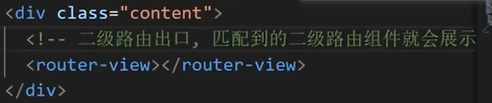

## 组件缓存

- 从某个页面返回到主页面，**数据被重新加载了**，通过**keep-alive**可以回到之前的页面位置（如阅读一系列文章那种）
- keep-alive
  - 是vue的内置组件，当它**包裹动态组件**时，会**缓存不活动的组件实例**，而不是销毁它们
  - 是一个抽象的**组件**，自身不会渲染成一个dom元素，也不会出现在父组件链中
  - 优点：在组件切换过程中把切换出去的组件**保留在内存**中，防止**重复渲染dom**，减少加载时间及性能消耗

- 问题：缓存了所有切换的组件即类似于上一次看的文章也被缓存了，点开下一个文章也会看到上一个文章

### keep-alive的三个属性

- **组件名！！！**是组件文件的script里面配置的组件名，是自己取的，没有组件名才用文件名
- include：组件名**数组**，**只有匹配**的组件会被缓存，数组里面**放的需要缓存**的
- exclude：组件名**数组**，**任何匹配的组件都不会**被缓存，数组里面**放的不被缓存**的其他都被缓存
- max：**最多**可以缓存多少组件实例
- 
- 加上组件缓存后会多两个生命周期钩子
  - actived：激活时，组件**被看到时触发**
  - deactived：失活时，**离开页面组件看不见**触发
  - 缓存后其他八个生命周期钩子就都**失效**了

## 自定义创建项目

- 基于VueCli自定义创建项目架子（黑马第88集）

### ESlint代码规范

- 如果代码不符合standard的要求，ESlint会在终端报错第几行第几个字符
- 解决方案
  - 手动改正，有一个**ESlint规则表**查询错误
  - 自动改正，

## vuex

- 是一个vue的**状态管理工具**，状态就是数据；vuex就是一个插件，可以帮助**管理vue通用的数据（多组件共享的数据）**
- 场景
  - 某个数据在很多个组件来使用（如个人信息）
  - 多个组件共同维护一个数据（如购物车）
- 优势
  - 共同维护一份数据，**数据集中化管理**
  - **响应式变化**
  - 操作简洁（vuex提供了一些辅助函数）

### 创建一个空仓库

- 安装vuex插件，初始化一个空仓库
- 基本步骤
  - 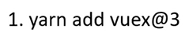
  - 
  - 
  - 
  - 代码：在**store/index文件创建仓库**
  - 代码：在**main.js导入**使用
  - 使用时与路由一样在vue组件里面通过**this.$store**访问

### state状态

- 提供数据：**state提供唯一的公共数据源**，所有共享的数据都要统一放到**store中的state中存储**，在state对象中可以添加我们要共享的数据

- 使用数据

  - **通过store直接访问**
    - this.$store访问仓库；或者import也可以导入仓库store
    - 在**template模板**中{{ $store.state.XXX }}
    - 在**组件的script逻辑**中用this.$store.state.XXX
    - 在js模块**如main.js**里面用store.state.XXX

  - 通过辅助函数（简化）
    - **mapState辅助函数**，帮助把store中的**数据自动映射**到组件的计算属性中，即自动完成以下代码
    - 使用方法
      - 导入：import {mapState} from 'vuex'
      - 引入：mapState(['变量名'，'变量名'……])，是一个对象，需要展开计算
      - 展开：

### mutations

- vuex也是单向数据流，所以组件不能直接**修改**仓库的数据，但是直接this.$store.state.count++（修改仓库数据）**vue不会报错**因为监测bug需要性能成本所以没有检测；在vue文件store实例时开启strict就会报错了
- 1、在**store文件夹里面的index文件里**定义mutations对象，对象中存放修改state的方法；所有mutations函数的第一个参数都是state
- 2、**组件中的逻辑方法里**提交调用mutations，**this.$store.commit('addCount')**，直接修改仓库数据

#### mutations传参

- **this.$store.commit('XXX'，参数)**
- 对应的在index文件提供mutations函数时就要带参数，称为提交载荷payload
- 传参**只能传一个**，如果有多个数据可以通过复杂数据类型（数组、对象）传参
- 通过input自定义数据，不能用v-model，用:value获取数据，@input监听，e.target.value获取值

#### mapMutations

- 把位于mutations中的方法提取出来，映射到组件methods中**（映射方法）**
- 在index文件里面提供一个方法
- 在组件里面引入并调用方法，这个代码逻辑**等价于自定义的传参调用**，可以多个传参
- 利用...展开进行使用时调用的语法是

### actions

- mutations是同步操作，只有**actions可以处理异步**操作，在index文件里面提供actions方法，context是上下文，与store相似
- 在页面调用时使用**dispatch**，依旧不能直接在组件页面操作仓库数据state，需要commit和mutations修改仓库数据，**参数只能传递一个**

#### mapActions

- 将actions中的方法提取出来，映射到组件methods中
- 引入的methods方法就与自己写的dispatch方法一样
- 调用时语法：**this.changeCountAction(参数)**，跟的是变量名

### getters

- 类似于计算属性，state派生出的状态，在这里面定义函数
- getters**第一个参数是state，必须有返回值**
- 访问getters，辅助函数映射属性写在计算属性，映射方法就写到方法里面

### module模块

- 由于vuex使用**单一状态树**，应用的所有状态（数据）会**集中到一个比较大的对象**
- 模块拆分，在store/modules/文件夹下面写多个js文件
- 在根文件里面需要导入挂载，一定记得是**modules里面挂载**

#### 如何访问state数据

- 虽然分了模块，但是子模块的数据挂载在根级别的state上了，属性名就是模块名
- 两种访问方式

- 

#### 访问getters的数据

- 注意直接访问的不同

#### 调用mutation

- 默认模块中的mutation和actions会被挂载到全局，**需要开启命名空间才会挂载到子模块**
- 

#### 调用action

- 同样挂载在了全局
- 

### 接口

- 

## 调整初始化目录

- 将目录调整为符合企业规范的目录
- 改成这样子的

## 常用组件库

- 

### vant组件库

#### 使用步骤

- **全部导入**：Vue.use就是插件安装初始化，内部会将所有的组件进行导入注册

- **按需导入**：分为手动和自动，导入代码一般写入utils文件夹中的js代码

#### Toast轻提示

- 用于用户完成了某个操作之后的提示

## 实战项目

### 项目中的vw适配

- 基于postcss插件实现项目vw适配，不同浏览器视图的适配，将px自动在呈现时转换为vw
- 

### 路由设计配置

- **单个页面独立**展示的就是**一级路由**
- 

- 二级路由配置要嵌套，可以加重定向**redirect: '/home'**
- vant组件库要实现路由转换加上**route以及to**

### 响应式拦截器

- 拿到数据的第一个**数据流转站**，可以在里面**统一处理错误**
- 涉及数据传输

### 将登录权证信息存入vuex

- 构建user模块

- 挂载到vuex
- 提供mutations
- 页面中commit调用

### storage存储模块-vuex持久化处理

- 封装storage存储模块，利用**本地存储进行vuex持久化处理**
- 将后台拿到的数据存在本地，封装为storage存储模块
- 

### 添加请求loading效果

- 在数据传输慢时，添加loading效果
- 作用
  - 节流处理：防止用户在一次请求还没成功时多次点击，发送无效请求
  - 友好提示：告知用户，目前是在加载中
- 实操步骤
  - 请求拦截器中，每次请求就打开loading
  - 响应拦截器中，每次响应就关闭loading

### 页面访问拦截

- 基于全局前置守卫，进行页面访问拦截处理
- 对未取得权限就登陆某些页面时需要进行**拦截**

#### 路由导航守卫

- 1、所有的路由一旦被匹配到，都会先经过全局前置守卫
- 2、只有全局前置守卫放行才会真正的解析渲染组件，看到内容
- to里面有两个path，fullpath会带上需要传输的值，path不会，所以在验证通过前往页面时**一般用path**，next是一个函数
- token是数据传输拿到的值

## 项目打包发布

- vuex只是辅助开发的，上线项目不需要参与上线
- 打包的作用
  - 将多个文件压缩合成为一个文件
  - 语法降级
  - less sass ts语法解析
- 打包后可以生成浏览器可以运行的网页，就是需要上线的源码
- 

## 打包优化：路由懒加载

- 目标：配置路由懒加载，实现打包优化
- 说明：当打包构建应用时，JS包会变得特别大，影响页面加载，可以将**不同路由对应的组件分割为不同的代码块**，然后**当路由被访问的时候才加载对应组件**，这样会**更高效**
- 分为两步

# AJAX

- AJAX是异步的js和XML，简单来说，就是使用**HMLHttpRequest对象与服务器通信**。它可以使用JSON、XML、HTML和text文本等格式发送和接收数据。AJAX有**异步特性**可以在不重新刷新页面的情况下与服务器通信，交换数据
- 使用axios库，与服务器进行数据通信

## axios调用

### 语法

- 

- ~~~js
  <script src="https://cdn.jsdelivr.net/npm/axios/dist/axios.min.js"></script>
  <script>
    axios({
      url: 'https://hmajax.itheima.net/api/province'
    }).then(res => {
      console.log(res)
    })
  </script>
  ~~~

## 认识URL

- 

### 组成

#### 协议

- http协议：超文本传输协议，规定**浏览器和服务器**之间传输数据的**格式**
- https

#### 域名（必需）

- 标记**服务器**在互联网中的**方位**

#### 资源路径

- 标记资源在**服务器**下的具体位置

### 查询参数

- 浏览器提供给服务器的**额外信息**，让服务器返回浏览器想要的数据
- 语法：

#### axios-查询参数

- 语法：使用axios提供的**params**选项，会自己拼接到URL后面

- ~~~js
  document.querySelector('.sel-btn').addEventListener('click', () => {
    let pname = document.querySelector('.province').value
    let cname = document.querySelector('.city').value
    axios({
      url: 'http://hmajax.itheima.net/api/area',
      params: {
        pname,
        cname
      }
    }).then(res => {
        //console.log(res)
        let list = res.data.list
        document.querySelector('.list-group-item').innerHTML = list.map(item => 
        `<li class="list-group-item">${item}</li>`).join('')
    })
  })
  ~~~

## 请求方法

- 对服务器资源执行的操作

### axios请求配置

- 

### 错误处理（弹窗）

- 

- ~~~js
  document.querySelector('.btn').addEventListener('click', () => {
    axios({
      url: 'http://hmajax.itheima.net/api/register',
      method: 'POST',
      data: {
        username: 'itheima007',
        password: '123456'
      }
    }).then(res => {
      console.log(res)
    }).catch(err => {
      let Err = err.response.data.message
      //console.log(Err)
      alert(Err)
    })
  })
  ~~~

## HTTP协议-请求报文

- HTTP协议规定了浏览器发送和服务器返回内容的**格式**
- 请求报文：浏览器按照HTTP协议要求的**格式**，发送给**服务器**的**内容**

### 组成部分

- 请求行：请求方法、URL、协议
- 请求头：以**键值对**的格式携带的附加信息，比如：Content-Type
- 空行：分隔请求头，空行之后的是发送给服务器的资源
- 请求体：发送的资源
- 在控制台旁边**网络面板**里面

### 错误排查

- 查看网络面板的请求报文可以看到**axios请求的数据**是否正确，从而发现错误

## HTTP协议-响应报文

- HTTP协议：规定了浏览器发送及服务器返回内容的**格式**
- 响应报文：服务器按照HTTP协议要求的**格式**，返回给**浏览器的内容**

### 组成部分

- 响应行（状态行）：协议、**HTTP响应状态码**、状态信息
- 响应头：以键值对的格式携带的附加信息，比如Content-Type
- 空行：分隔响应头。空行之后的是服务器返回的资源
- 响应体：**返回的资源**

### HTTP响应状态码

- 用来表明请求**是否成功**完成
- 404是服务器找不到资源了

## 接口文档

- 描述接口的文章
- 接口：使用AJAX和服务器通讯时，使用的**URL，请求方法以及参数**

### 登录案例

- ~~~js
  <script>
    // 目标1：点击登录时，用户名和密码长度判断，并提交数据和服务器通信
    const myAlert = document.querySelector('.alert')
    function showAlert(msg, isSuccess) {
      myAlert.classList.add('show')
      myAlert.innerHTML = msg
      const bgStyle = isSuccess ? 'alert-success' : 'alert-danger'
      myAlert.classList.add(bgStyle)
      setTimeout(() => {
        myAlert.classList.remove('show')
        myAlert.classList.remove(bgStyle)
      }, 2000)
    }
    document.querySelector('.btn-login').addEventListener('click', () => {
      const username = document.querySelector('.username').value
      const password = document.querySelector('.password').value
      if (username.length < 8) {
        showAlert('错了,用户名大于8', false)
        console.log('大于8')
        return
      }
      if (password.length < 6) {
        showAlert('错了，密码大于6', false)
        console.log('大于6')
        return
      }
      axios({
        url: 'http://hmajax.itheima.net/api/login',
        method: 'post',
        data: {
          username,
          password
        }
      }).then(res => {
        showAlert('成功了', true)
        console.log(res.data.message)  
      }).catch(err => {
        showAlert('登陆失败', false)
        console.log(err.response.data.message)
      })
    })
  </script>
  ~~~

## form-serialize插件

- 作用：**快速**收集表单元素的值
- 用法：导入lib包
- 语法：收集到了**data对象**当中
- hash为true获取到的就是对象，false就是查询字符串以&链接；empty设置是否获取空值，false时为空值就不会放入对象
- 注意：在使用时表单元素需要**name属性**以明确获得那些，然后解构让变量获得值

## Bootstrap弹窗

- 来自掘金的介绍：[十分钟上手前端UI框架BootstrapBootstrap是一个简洁、直观、强悍的前端开发框架，使得 Web 开发更加快 - 掘金 (juejin.cn)](https://juejin.cn/post/6844903811329294350?searchId=20240829134533846E56BE93A0EC589492)
- 功能：不离开当前页面，显示单独内容供用户操作，是一个web前端框架
- 步骤
  - 引入bootstrap.css和bootstrap.js
  - 准备弹框标签，确认结构
  - 通过自定义属性，控制弹框的显示和隐藏 
- modal代表弹框类型，css选择器是绑定点击按钮对应哪个弹框显现

### 使用

- ~~~html
  <!-- 最新版本的 Bootstrap 核心 CSS 文件 -->
  <link rel="stylesheet" href="https://cdn.jsdelivr.net/npm/bootstrap@3.3.7/dist/css/bootstrap.min.css">
  
  <!-- 可选的 Bootstrap 主题文件（一般不用引入） -->
  <link rel="stylesheet" href="https://cdn.jsdelivr.net/npm/bootstrap@3.3.7/dist/css/bootstrap-theme.min.css">
  
  <!-- 最新的 Bootstrap 核心 JavaScript 文件 -->
  <script src="https://cdn.jsdelivr.net/npm/bootstrap@3.3.7/dist/js/bootstrap.min.js"></script>
  ~~~

## 图片上传

- 1、获取图片文件对象
- 2、使用FormData携带图片文件
- 这个需要后端接口，参数名后端给
- 3、提交表单数据到服务器，使用图片url网址

## 更换背景图片

- 1、选择图片上传，设置body背景
- 2、上传成功时、保存url网址
- 如果刷新之后还要有就需要存在本地储存
- 为了第一次进入页面不会报错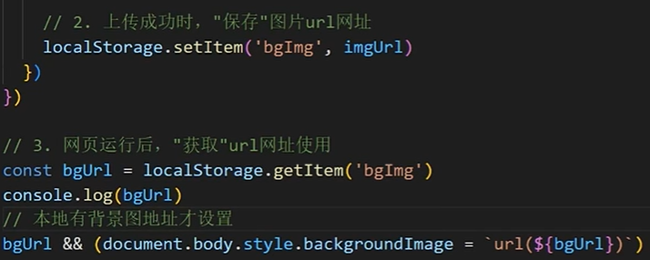

## AJAX原理-XMLHttpRequest

- axios内部采用XHR与服务器交互

### 使用XMLHttpRequest

- 步骤
- 还有第四步**调用send方法，发起请求**

### XHR查询参数

- 浏览器提供给服务器的**额外信息**，让服务器返回浏览器想要的数据

### XHR数据提交

- 核心：

## Promise

- Promise对象用于表示一个**异步操作**的最终完成（或失败）及其结果值
- 代码演示

### Promise三种状态

- 一个Promise对象一旦被**兑现/拒绝**就是已敲定了，**状态无法再改变**，Promise创建成功马上执行，然后往下走，只不过异步任务还在待定中

## 同步代码、异步代码

- 同步：逐步执行，原地等待
- 异步：调用后耗时，不会阻塞代码继续执行（不会原地等待），在完成后触发一个**回调函数**

## 回调函数地狱

- 概念：回调函数的**嵌套**
- 缺点：可读性差，异常无法捕获，耦合性严重，牵一发动全身；在**里面的axios有异常时无法捕获**

### 解决方法—Promise的链式调用

- 概念：依靠then()方法会返回一个**新生成的Promise对象**特性，继续串联下一环任务直到结束
- 细节：then()回调函数中的返回值，会影响新生成的Promise对象**最终状态和结果**
- 

## Promise链式应用

- 每个Promise对象中管理一个异步任务，用then返回Promise对象，串联起来
- 

## async函数和await

- 
- 概念：在async函数内使用**await关键字取代then函数**，**等待**获取Promise对象**成功状态的结果值**

### async函数和await_捕获错误

- 使用try—catch，如果try包含的代码出现错误后面的就不会再执行了

## 事件循环（EventLoop）

- JS是单线程的，某一时间只能执行一行代码。事件循环：执行代码和收集异步任务时，反复**调用任务队列**里回调函数执行机制
- 在js内部执行顺序是

## 宏任务与微任务

- ES6之后引入了Promise对象，让js引擎也可以发起异步任务
- 异步任务分为
  - 宏任务：由**浏览器**环境执行的异步代码
  - 微任务：由**JS引擎**环境执行的异步代码

- 在调用栈的代码执行完毕后会反复去任务队列获取任务执行**微任务队列优先于宏任务队列**

## Promise.all静态方法

- 概念：合并多个Promise对象，等待所有同时成功完成（或某一个失败），做后续逻辑
- 传参是数组，返回结果也是数组
- 代码实现

# Node.js

- Node.js是一个跨平台Javascript运行环境，使开发者可以搭建服务器端的Javascript应用程序
- 前端工程化：开发项目到上线，过程中集成的所有工具和技术。Node.js是前端工程化的基础（因为Node.js可以主动读取前端代码内容）
- 使用node.js：右键打开终端，然后**node 文件名**运行文件。在终端中，方向键的上就是自动执行上一个操作

- 浏览器能执行js代码，依靠的是内核中的v8引擎（c++程序）

## fs模块—读写文件

- 模块：类似于插件，封装了**方法/属性**
- fs模块：封装了与**本机文件系统**进行交互的方法和属性

### 语法

- 1、**加载**fs模块对象
- 2、**写入**文件内容
- 3、读取文件内容

## path模块—路径处理

- node中，**相对路径要根据终端所在路径**来查找，不然可能找不到
- 在node中使用**绝对路径**
- 语法
  - 1、加载path模块
  - 2、使用path.join方法，拼接路径
  - 新版本不需要了

## 压缩html

- 将\r和\n去掉后写入到新的html文件中

### 步骤

- 1、**读取**源html文件内容
- 2、正则**替换**字符串
- 3、**写入**到新的html文件中
- 

## URL中的端口号

- URL：统一资源定位符，简称网址，用于访问服务器里的资源
- 端口号：标记服务器里不同功能的**服务程序**
- 端口号范围：0-65535之间的任意整数
- 网址构成：注意的是http协议会默认访问80端口

### 常见的服务程序

- web服务程序：用于提供网上信息浏览功能
- 注意：0-1023和一些特定端口号被占用，自己编写服务程序应该避开使用

## http模块—创建web服务

### 步骤

- 1、加载http模块，创建web服务对象
- 2、监听request请求事件，设置响应头和响应体
- 3、配置端口号并启动web服务
- 4、浏览器请求http://localhost:3000测试，localhost就是固定代表本机的域名
- 终端会显示listen中的代码，访问3000的网址会显示on的代码，终端通过ctrl+c结束进程（开服务相当于开了个新进程）

### 案例

- 

## node.js模块化

- 
- 概念：项目是由多个模块文件组成的；好处：提高代码复用性，按需加载，**独立作用域**；使用：需要标准语法**导出和导入**进行使用

### CommonJS标准

#### 导入导出

- 导入需要变量承接
- 导入有两种情况

#### 代码演示

- 
- 

## ECMAScript标准—默认导出和导入

- 和vue一样的
- 注意：node.js默认支持CommonJS，如果要用es的标准语法需要在**文件夹建一个package.json文件夹，并且设置{"type":"module"}**（vue不需要）

## ECMAScript标准—命名导出和导入

- 导出：
- 导入：
- **按需**加载用**命名**导出和导入；**全部**加载用**默认**导出和导入

## 包的概念

- 将**模块、代码、其他资料**聚合成一个文件夹
- 包分类：
  - 项目包：主要用于编写**项目和业务逻辑**
  - 软件包：**封装工具和方法**进行使用
- 要求：根目录中，必须有package.json文件（记录包的清单信息）
- 注意：导入软件包时，引入的**默认是index.js**模块文件如果没有就会去找**package.json文件的main属性指定**的模块文件

## npm—软件包管理器

- npm是node.js标准的软件包管理器

### 使用

- 

### 图解

- 

## npm—全局软件包nodemon

- 本地软件包：**当前项目**内使用，封装**属性和方法**，存在于node_modules
- 全局软件包：**本机**所有项目使用，封装**命令和工具**，存在于系统设置的位置
- nodemon作用：替代node命令，检测代码更改，自动重启程序

### npm—操作命令

- g就是全局

# webpack

- 定义：
- 静态模块：指的是编写代码过程中的html，css，js，图片等固定内容的文件

## 打包

- 把静态模块内容压缩、整合、转译等（前端工程化）
  - 把less/sass转成css
  - 把ES6+降级为ES5以适应低级浏览器
  - 支持多种模块标准语法

## 使用webpack

- 步骤：
  - 1、新建并初始化项目，编写业务源代码
  - 2、下载webpack webpack-cli到当前项目中（版本独立），**配置**局部自定义命令
  - 3、运行打包命令，自动产生dist分发文件夹（压缩和优化后，用于最终运行的代码）
- 运行逻辑

## webpack打包入口和出口

- 默认**入口是index.js**，默认**出口是dist下的main.js**

### 修改出入口

#### 步骤

- 1、项目根目录新建webpack.config.js配置文件
- 2、导出配置对象，配置入口，出口文件的路径
- 3、重新打包
- 注意：只有和入口产生直接/间接的引入关系，才会被打包

- 官方文档：[概念 | webpack 中文文档 | webpack中文文档 | webpack中文网 (webpackjs.com)](https://www.webpackjs.com/concepts/)
- 文件要建在根文件
  - 入口
  - 出口，加一个**clean：true**可以把以前的清除干净之后再放入新的打包内容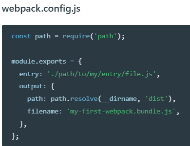

## 自动生成html文件

- 插件**html-webpack-plugin**在webpack打包时生成html文件

### 步骤

- 找包，下包，配置包
- 1、下载html-webpack-pugin本地软件包
- 2、**配置**webpack.config.js让webpack拥有插件功能
- 3、重新打包观察效果

## 打包css代码

- 官网Loader

### 步骤

- 1、准备css文件代码引入到src/login/index.js中（压缩转译处理等）
- 2、下载css-loader和style-loader本地软件包
- 3、配置webpack.config.js让webpack拥有该功能
- 4、打包

### 优化打包css

- 因为默认方法会把css打包进js文件，js和css杂在一起，所以有了优化方法，，打包到新文件而不是和js在一起

### 压缩css

- 虽然打包了css，但是没有压缩，写什么样子就是什么样子，所以还需要压缩一下（生产模式压缩插件）[webpack 中文文档 | webpack中文文档 | webpack中文网 (webpackjs.com)](https://www.webpackjs.com/plugins/mini-css-extract-plugin#root)

#### 步骤

- 下、配、用
- 下
- 配

## 打包图片

- webpack5内置资源模块（字体、图片等）打包，无需额外loader
- 官网搜索**资源模块**
- 如果图片小于8kb就存为文件
- 大于8kb
- 有老版本和新的

### 配置

- 代码
- 内有逻辑
- 两种方案，**js中**引入**本地图片**资源要用**import**的方式（如果是**网络图片http**地址，字符串可以直接写）


## 搭建开发环境

- 问题：之间改代码，需要重新打包才能运行查看，效率很低
- 开发环境：配置webpack-dev-server快速开发应用程序
- 作用：启动web服务，**自动**检测代码变化，**热更新**到网页
- 开发环境：没有上线，自己电脑上的时候；生产环境：部署上线之后，给用户用了

### 步骤

- 最后使用npm run dev打包启动开发服务器

### 各个文件

- public是默认根文件，打包后的内容在内存，可以在webpcak.config.js文件去改output路径

## 打包模式

### 开发模式

- 

### 生产模式

- 

### 设置

- 命令行的优先级高于文件配置
- 
- 方式1代码不推荐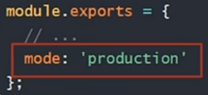
- 方式2代码

### 打包模式的应用

- 需求在开发模式下用style-loader内嵌更快，在生产模式下提取css代码
- 方案
  - 1、webpack.config.js配置导出函数，但是局限性大（只有两种模式）
  - 2、借助cross-env（跨平台通用）包命令，设置参数区分环境
  - 3、配置**不同的webpack.config.js**（适用多种模式差异性较大情况）

- 步骤
  - 1、下载**cross-env**软件包到当前项目
  - 2、配置自定义命令，传入参数名和值（会绑定到**process.env**对象下）
  - 3、在webpack.config.js区分不同环境使用不同配置
  - 4、重新打包观察两种配置区别

## 注入环境变量

- 需求：前端项目中，**开发模式下打印语句生效**，生产模式下打印语句**失效**
- 问题：
- 解决：使用webpack内置的**DefinePlugin**插件
- 作用：在编译时，将前端代码中匹配的变量名，替换为值或表达式
- [环境变量 | webpack 中文文档 | webpack中文文档 | webpack中文网 (webpackjs.com)](https://www.webpackjs.com/guides/environment-variables/)
- 配置代码

## 开发环境调错—source map

- 问题：代码被压缩和混淆，无法正确定位源代码位置（行数和列数）
- source map：可以准确追踪**error和warning在原始代码**的位置
- 设置：webpack.config.js配置**devtool**选项
- inline-source-map选项：把源码的位置信息一起打包在js文件内
- 注意：source map仅适用于开发环境，**不要在生产环境使用**（防止被轻易岔开源码位置）

## 解析别名alias

- 解析别名：配置模块如何解析，创建import引入路径的别名，来确保模块引入变得简单
- 在webpack.config.js中配置解析别名@来代表src绝对路径，resolve就是解析，alias就是别名
- **原来**是
- **这么改**
- **写路径**

## 优化-CDN使用

- CDN定义：内容分发网络，指的是一组**分布在各个地区的服务器**
- 作用：把静态资源文件/第三方库放在CDN网络中各个服务器中，供用户就近请求获取
- 好处：减轻自己服务器请求压力，就近请求物理延迟低，配套缓存策略
- 需求：**开发模式**使用**本地**第三方库，**生产模式**下使用**CDN加载**引入
- 

### 步骤

- 需求：开发模式使用本地第三方库，生产模式下使用CDN加载引入
  - 1、在html中引入第三方库的CDN地址并用模板语法判断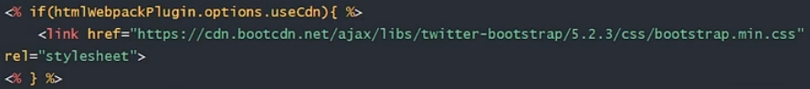
  - 2、配置webpack.config.js中externals外部扩展选项（防止某些import的包被打包）
  - 3、两种模式下打包观察效果

## 多页面打包

- 单页面：单个html文件，切换DOM的方式实现不同业务逻辑展示
- 多页面：多个html文件，切换页面实现不同业务逻辑展示

### 步骤

- 1、准备**源码**（html、css、js）放入相应位置，并改用模块化语法**导出**
- 2、下载form-serialize包并**导入**到核心代码中使用
- 3、配置webpack.config.js**多入口和多页面**的设置

## 优化-分割公共代码

### 步骤

- 1、**配置**webpack.config.js的**splitChunks**分割功能
- 2、打包观察

# Git

- 概念：一个免费开源，分布式的**代码版本**控制系统，帮助开发团队维护代码
- 作用：**记录**代码内容，**切换**代码版本，多人开发时高效**合并代码**内容
- 检测在专属终端

## Git配置用户信息

- 

## Git仓库

- Git仓库：记录文件**状态**内容的地方，存储着**修改的历史记录**

### 创建

- 1、把本地文件夹**转换**为Git仓库，命令是**git init**
- 2、从其他服务器上**克隆**Git仓库

## Git的三个区域

- 工作区：实际**开发**时操作的文件夹
- 暂存区：保存之前的**准备区域**（暂存改动过的文件）
- 版本库：提交并**保存**暂存区中的内容，产生一个版本快照

### 使用流程

- add将代码提交到暂存区；commit将代码提交保存到版本库，要跟上每个版本的备注

- 逻辑图

## Git文件状态

### 两种状态

- 1、未跟踪：新文件，从未被Git管理过
- 2、已跟踪：Git已经知道和管理的文件
- 查看原来提交到版本库的代码版本用**git log -- oneline**
- 全部状态
- 需求：新增css文件，并使用**git status -s**查看文件状态，并最终提交，第一列是暂存区状态，第二列是工作区状态
- 在工作区就会提示

## Git暂存区使用

- 暂存区：暂时存储，可以临时恢复代码内容，与版本库解耦，不用每次提交都是去版本库
- 暂存区的内容覆盖当前工作区内容，即回到上一个提交add的版本需要执行**git restore 目标文件**（注意：完全确认覆盖时使用，这个时候**第一次跟踪的文件将不再被跟踪**）
- 从暂存区删除一个版本的代码：**git rm --cached 目标文件**

## Git回退版本

- 概念：把版本库某个版本对应的内容快照，恢复到工作区/暂存区
- 查看提交历史：**git log --oneline**
- 完整的提交：git reflog --oneline

### 回退命令

- git reset --soft 版本号（其他文件未跟踪）
  - 工作区和暂存区的其他文件都会被保留并跟踪
- **git reset --hard** 版本号
  - 暂存区的都会被覆盖，暂存区如果有回退版本没有的**文件会被删除**，，只有**被跟踪的文件才会被git reset --hard处理**
- git reset --mixed 版本号（默认效果）
  - 暂存区内容会被覆盖，工作区不会；工作区代码还在，但是**暂存区没有**了即未跟踪

## 删除文件

- 可以删除一个文件，并产生一次版本记录

### 步骤

- 1、手动删除工作区文件
- 2、暂存变更git add ./手动删除暂存区文件造成变更
- 3、提交保存
- 总结：工作区只要改变，都可以暂存提交产生新纪录

## 忽略文件

- 概念：.gitignore文件可以让git彻底**忽略跟踪**指定文件
- 目的：让git仓库更小更快，避免重复无意义的文件管理
- 例如
  - 1、系统或软件自动生成的文件
  - 2、编译产生的结果文件
  - 3、运行时生成的日志文件，缓存文件，临时文件
  - 4、涉密文件，密码，密钥等
  -  

- 创建：1、项目根目录新建.gitignore文件；2、填入相应配置来忽略指定文件；注意：如果文件已经被暂存区跟踪过，可以从暂存区移除即可

# vue3

- 四大优势
  - 更容易维护：组合式API；更好的TypeScript支持
  - 更小的体积：良好的TreeShaking；按需引入
  - 更快的速度：重写diff算法；模板编译优化；更高效的组件初始化
  - 更优的数据响应式：利用es7的Proxy重写了底层

## create-vue创建项目

- create-vue是Vue**官方新的脚手架工具**，底层切换到了**vite（下一代构建工具）**，为开发提供极速响应

## 项目目录和关键文件

- 
- 注意插件变换，**vue2是vetur、vue3是Vue-Official**。加上**setup允许在script中直接编写组合式API**

## 组合式API—setup选项

### setup选项的写法和执行时机

- 写法
- 执行时机**比beforeCreate还要早，所以用不了this指向组件实例，指向的是undefined**
- **setup**中数据和函数需要在最后return才能在模板template中使用

### 语法糖写法（新setup）

- 把setup标签写到script里面
- 原理

## 组合式API—reactive(响应式数据)

- 作用：接收**对象类型数据的参数**传入并返回一个**响应式的对象**
- 核心步骤：
  - 1、从vue包中导入reactive函数
  - 2、在<script setup>中执行**reactive函数，并传入类型为对象**的初始值，并使用变量接收返回值
  - 

### ref()函数做响应式

- 作用：接收**简单类型或者对象类型的数据**传入并返回一个**响应式的对象**
- 核心步骤：
  - 1、从vue包中导入ref函数
  - 2、在<script setup>中执行**ref函数**并传入初始值，使用变量**接收ref函数的返回值**
  - 本质是**原有数据类型基础上，外层包了一个对象**，包成了复杂类型，再借助reactive实现了响应式
  - script中访问数据**要用.value**，template中帮我们把外层对象去除了，可以直接用

## 组合式API—computed计算属性

- 核心步骤：
  - 1、导入computed函数
  - 2、**执行函数**在回调参数中**return基于响应式数据做计算的值，用变量接收**
  - 
  - 计算属性中**不应该有异步请求/修改dom**，同时要避免直接修改计算属性的值

## 组合式API—watch函数

- 侦听**一个或者多个数据**的变化，数据变化时执行回调函数

### 深浅侦听（地址）

- **两个额外参数**：1、immediate（立即执行）；2、deep（深度侦听）watch函数默认侦听简单数据类型（栈空间的内容，如果是复杂数据类型就是**侦听的地址**，只有地址变了才会变），如果是**复杂数据类型是侦听不到内部数据的变化的**

### 侦听单个数据

- 步骤：
  - 1、导入watch函数
  - 2、执行**watch函数**传入要侦听的响应式数据**(ref对象)和回调函数**
  - 一旦数据发生变化，就会执行回调函数

### 侦听多个数据

- 说明：同时侦听多个响应式数据的变化，不管哪个数据变化都需要侦听，通过数组传值

### 精准侦听对象的某个属性

- 在不开启deep的前提下，侦听age的变化，只有**age变化时才执行回调**

- ~~~js
    watch(
      () => p.value.name,
      () => console.log(p.value.name)//这个地方不同语句必须写成两个箭头函数
    )
  //侦听多个shu'ju
    watch(
      () => p.value.age,
      () => console.log(p.value.age)
    )
    const nameChange = () => {
      p.value.name = "哈哈"
      p.value.age = '2'
    }
  ~~~

## 组合式API—生命周期函数

- vue3的生命周期API
- 在script标签加上setup就可以执行在页面刚打开时的某些操作，而且后面这些**组合式API类似于函数，可以反复调用操作**，同时注意销毁的改变

## 组合式API下的父传子props

- 基本思想
  - 1、父组件中给**子组件绑定属性**
  - 2、子组件内部通过**props选项接收**（写了setup无法**直接配置props选项**，要借助**于“编译器宏”函数接收**子组件传递的数据）
  - 局部组件导入即用
  - 

### 编译器宏

- defineProps原理：**就是编译阶段的一个标识**，实际编译器解析时，遇到后会进行编译转换

## 组合式API下的子传父emit

- 基本思想
  - 1、父组件中给**子组件标签通过@绑定事件**
  - 2、子组件内部通过**emit方法触发事件**
  - 

## 组合式API—模板引用

- 通过**ref标识**获取真实的**dom对象或者组件实例对象**
- 获取模板时机应该是在组件挂载完毕之后（onMounted）
- 获取dom与组件类似
  - 1、调用ref函数生成一个ref对象
  - 2、通过ref标识绑定ref对象到标签
  - 要同名
  - 代码演示

### 获取组件会不同

- 默认在<script setup>语法糖下**组件内部的属性和方法**是不开放给父组件访问的，可以通过**defineExpose**编译宏**指定哪些属性和方法允许访问**
- 子组件
- 父组件

## 组合式API—provide和inject

### 作用和场景

- 顶层组件向任意的底层组件**传递数据和方法**，实现**跨层组件通信**

### 跨层传递普通数据

- 1、顶层组件通过provide函数提供数据
- 2、底层组件通过inject函数获取数据
- 如果需要在子组件修改上面祖宗的数据，可以传一个方法函数给子组件，这样子组件调用函数就能在祖宗函数修改数据
- 这里是写的响应式数据和方法，也可以直接写死数据，在provide那里就不需要key名

## defineOptions

- 背景说明：有<script setup>之前，如果要定义props，emits可以添加一个与setup平级的属性。但是用了<script setup>之后，就没有了setup属性，所以不能添加与其平级的属性
- 解决方法：
  - 1、引入了**defineProps和defineEmits两个宏**，但是只解决了**props和emits**两个属性。如果要定义组件的name或其他自定义属性，只能再添加一个普通**不加setup的script标签**
  - 2、在vue3.3以上版本引入了**defineOptions宏**，主要用于定义Options API的选项，可以用defineIOptions定义任意的选项，**props、emits、expose、slots要用defineXXX实现**

## defineModel（v-model双向绑定）

- 
- [一文搞懂 Vue3 defineModel 双向绑定：告别繁琐代码！随着vue3.4版本的发布，defineModel也 - 掘金 (juejin.cn)](https://juejin.cn/post/7331021519965356071?searchId=202409211741272F011D85FD3C6963CD01)
- 父组件子组件

## Pinia

- Pinia是Vue的最新**状态管理工具**，是**Vuex的替代品**
- 

### 手动添加Pinia到Vue项目

- 1、使用vite创建一个空的vue3项目：npm create vue@latest
- 2、按官方文档（[Pinia | The intuitive store for Vue.js (vuejs.org)](https://pinia.vuejs.org/zh/)）安装pinia到项目中

### Pinia的基本语法

#### 基础使用

- 1、定义store（官网看）
  - option store
  - setup store
- 2、组件使用store

### action异步实现

- 编写方式：异步action函数的写法和**组件中获取异步数据的写法是一致的**
- 

### storeToRefs

- 在组件里面直接结构仓库数据会丢失响应式
- 解决方法
- 原因：store是一个用**reactive包装的对象**，他是通过props实现的响应式（**对象**），如果解构了仓库返回的对象就是**声明了新变量接收值**，是不能再被监听到的

### Pinia持久化

- 跟着官网来[Vue3如何使用Pinia详细介绍、pinia持久化存储(pinia-plugin-persistedstate详细配置)-阿里云开发者社区 (aliyun.com)](https://developer.aliyun.com/article/1580509)
- [Home | pinia-plugin-persistedstate (prazdevs.github.io)](https://prazdevs.github.io/pinia-plugin-persistedstate-v2/)

# 项目实战

- 涉及知识

## pnpm包管理器

- 比同类工具快，节省磁盘空间https://www.pnpm.cn/
- 创建用pnpm create vue
- 执行命令

## Eslint配置代码风格

- Eslint用于代码纠错，prettier用于美化代码风格

- 配置文件.eslintrc.cjs（提前操作）

  - 1、prettier 风格配置 [https://prettier.io](https://prettier.io/docs/en/options.html )
    1. 单引号

    2. 不使用分号

    3. 每行宽度至多80字符

    4. 不加对象|数组最后逗号

    5. 换行符号不限制（win mac 不一致）
  - 2、vue组件名称多单词组成（忽略index.vue）

  - 3、props解构（关闭）

  ```jsx
    rules: {
      'prettier/prettier': [
        'warn',
        {
          singleQuote: true, // 单引号
          semi: false, // 无分号
          printWidth: 80, // 每行宽度至多80字符
          trailingComma: 'none', // 不加对象|数组最后逗号
          endOfLine: 'auto' // 换行符号不限制（win mac 不一致）
        }
      ],
      'vue/multi-word-component-names': [
        'warn',
        {
          ignores: ['index'] // vue组件名称多单词组成（忽略index.vue）
        }
      ],
      'vue/no-setup-props-destructure': ['off'], // 关闭 props 解构的校验
      // 💡 添加未定义变量错误提示，create-vue@3.6.3 关闭，这里加上是为了支持下一个章节演示。
      'no-undef': 'error'
    }
  ```

  

## 配置代码检查工作流

- 